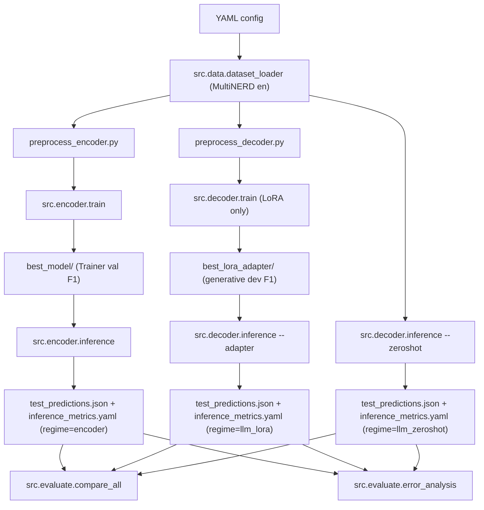

# 1. Project Overview

## 1.1 What This Repository Is

This repository contains the experimental code for a bachelor thesis project that compares two paradigms for **Named Entity Recognition (NER)** on a single shared benchmark.

Named Entity Recognition is the task of finding spans in text that refer to named entities and assigning each span an entity type. For example, given the sentence

```text
Berlin is the capital of Germany.
```

an NER system should produce entity spans such as `Berlin → LOC` and `Germany → LOC`.

This project implements, trains, evaluates, and compares:

| Paradigm | Regime | How it solves NER |
| --- | --- | --- |
| Encoder token classification | Fine-tuned | A DeBERTa model with a token classification head predicts one BIO label per subword token. |
| Generative LLM | Zero-shot | A Qwen3.5 base model is prompted with instructions and a sentence, and generates a JSON list of entities. No training is performed. |
| Generative LLM | LoRA / QLoRA | The same Qwen3.5 base model is first fine-tuned on the benchmark via LoRA/QLoRA and then used to generate the same JSON entity list. |

All three regimes are evaluated against the same MultiNERD English test split using identical entity-level metrics. The decoder pipeline (zero-shot and LoRA) uses the same prompt, the same parser, and the same output schema, so the only difference is whether a trained adapter is loaded on top of the base model.

## 1.2 Final Active Setup at a Glance

The final active experimental matrix contains **eight experiments**:

| # | Experiment | Paradigm | Regime | Base model |
| --- | --- | --- | --- | --- |
| 1 | `deberta-v3-base`      | Encoder | Fine-tuned  | `microsoft/deberta-v3-base` |
| 2 | `deberta-v3-large`     | Encoder | Fine-tuned  | `microsoft/deberta-v3-large` |
| 3 | `qwen35-08b-zeroshot`  | LLM     | Zero-shot   | `Qwen/Qwen3.5-0.8B` |
| 4 | `qwen35-4b-zeroshot`   | LLM     | Zero-shot   | `Qwen/Qwen3.5-4B` |
| 5 | `qwen35-27b-zeroshot`  | LLM     | Zero-shot   | `Qwen/Qwen3.5-27B` |
| 6 | `qwen35-08b-qlora`     | LLM     | LoRA/QLoRA  | `Qwen/Qwen3.5-0.8B` |
| 7 | `qwen35-4b-qlora`      | LLM     | LoRA/QLoRA  | `Qwen/Qwen3.5-4B` |
| 8 | `qwen35-27b-qlora`     | LLM     | LoRA/QLoRA  | `Qwen/Qwen3.5-27B` |

All eight experiments use **MultiNERD English** as the only active benchmark dataset.

## 1.3 What the Repository Produces

For each experiment, the repository produces:

- A test-set predictions file (`test_predictions.json`).
- A structured metrics file (`inference_metrics.yaml`) that records entity-level F1, precision, recall, latency, VRAM peak, parameter counts, parser statistics (for LLMs), and the `regime` field.
- For trained models, training artifacts such as best checkpoints (`best_model/` for encoders, `best_lora_adapter/` for LoRA LLMs).
- Cross-experiment comparison artifacts: a Rich terminal table, a bar plot of F1 scores, a per-entity-type heatmap, and a LaTeX table suitable for a thesis document.

Most commands in this document assume that the working directory is `ba-ner/`:

```bash
cd ba-ner
```

# 2. Research Goal

## 2.1 Why Compare Encoder NER and LLM-based NER

Encoder-based NER (e.g., DeBERTa, BERT, RoBERTa) is the classical discriminative approach: a token-level classification head maps subword representations to BIO labels. It is strong, well understood, and inherits a fixed label space from the classification head.

Generative NER with a large language model (e.g., Qwen3.5) reformulates the task as structured text generation: the model is given an instruction and a sentence, and produces a JSON list of entities. This is more flexible, can in principle handle new entity types through prompting alone, and is closer to how LLMs are used in practice.

This thesis compares both paradigms on identical data and identical evaluation metrics, so that the difference in measured F1 reflects the approach — not data leakage, not tokenizer differences, and not evaluation asymmetries.

## 2.2 Why Zero-Shot vs Fine-Tuned LLMs Both Matter

Comparing encoders to only one LLM regime would hide an important question: how much of the LLM's NER quality comes from the base model, and how much comes from fine-tuning on the target benchmark?

To answer this, each Qwen3.5 base model is evaluated in two regimes:

- **Zero-shot** — the pre-trained base model is prompted directly. No training on the benchmark.
- **LoRA / QLoRA** — the same base model is fine-tuned on MultiNERD via parameter-efficient fine-tuning, and then evaluated using the trained adapter.

This gives three meaningful comparisons:

1. Fine-tuned encoder vs. fine-tuned LLM at roughly matched scale (e.g., DeBERTa-v3-large ≈ 0.4B vs. Qwen3.5-0.8B).
2. Fine-tuned LLM vs. zero-shot LLM (same base model) → measures the value added by LoRA/QLoRA.
3. Zero-shot LLM at increasing scale (0.8B → 4B → 27B) → measures how far raw model scale alone carries NER quality on MultiNERD.

## 2.3 Why Multiple Qwen Sizes

Three Qwen3.5 sizes are included (0.8B, 4B, 27B) so that the scaling behavior of LLM-based NER can be observed. The 0.8B variant is particularly useful because its parameter count is in the same order of magnitude as `deberta-v3-large` (~435M), which enables a semi-fair comparison "small LLM with LoRA" vs. "large encoder fully fine-tuned".

## 2.4 What Is Measured

| Measurement | Why it matters |
| --- | --- |
| Entity-level precision, recall, F1 (seqeval) | Core quality; a span counts only if boundaries and type match. |
| Per-entity-type F1 | Shows which entity categories are easy or hard per model. |
| Training runtime | Cost of fine-tuning; zero-shot has no training time. |
| Inference latency (mean, p95) | Relevant for interactive or large-scale deployment. |
| VRAM peak | Hardware feasibility. |
| Trainable and total parameters | Distinguishes full fine-tuning, LoRA (small trainable), and zero-shot (none trainable). |
| Parse failure rate (LLM only) | Robustness of generated structured output. |

## 2.5 Why Parse Robustness Matters

A generative LLM does not always produce the exact JSON schema that the evaluation expects. Answers can be wrapped in Markdown code fences, can be truncated, can contain Qwen3 `<think>...</think>` blocks, or can use unknown entity types. Parse failure rate is a first-class metric in this project: a model that produces 0.9 F1 on parseable output but fails to parse 40% of answers is not useful in practice. The decoder parser in `src/decoder/parse_output.py` uses a deterministic three-stage fallback and reports per-status counts so that this can be analyzed explicitly.

# 3. Final Experimental Setup

The final setup is intentionally narrow. Legacy experiments that predate this setup should not be treated as current.

## 3.1 Encoder Experiments (Fine-Tuned)

| Config | HF model | Experiment name | Output directory |
| --- | --- | --- | --- |
| `configs/deberta_base.yaml`  | `microsoft/deberta-v3-base`  | `deberta-v3-base`  | `results/multinerd/deberta-v3-base/`  |
| `configs/deberta_large.yaml` | `microsoft/deberta-v3-large` | `deberta-v3-large` | `results/multinerd/deberta-v3-large/` |

Both encoder configs are pure token classification. There is no encoder zero-shot regime — encoders are always fine-tuned in this project.

## 3.2 LLM Zero-Shot Experiments (No Training)

| Config | HF base model | Experiment name | Output directory |
| --- | --- | --- | --- |
| `configs/qwen35_08b_zeroshot.yaml` | `Qwen/Qwen3.5-0.8B` | `qwen35-08b-zeroshot` | `results/multinerd/qwen35-08b-zeroshot/` |
| `configs/qwen35_4b_zeroshot.yaml`  | `Qwen/Qwen3.5-4B`   | `qwen35-4b-zeroshot`  | `results/multinerd/qwen35-4b-zeroshot/`  |
| `configs/qwen35_27b_zeroshot.yaml` | `Qwen/Qwen3.5-27B`  | `qwen35-27b-zeroshot` | `results/multinerd/qwen35-27b-zeroshot/` |

Each zero-shot config sets `mode: zeroshot`. These configs intentionally contain no training hyperparameters; they are used **only by `src.decoder.inference --zeroshot`**.

## 3.3 LLM LoRA / QLoRA Experiments (Fine-Tuned)

| Config | HF base model | Experiment name | Output directory |
| --- | --- | --- | --- |
| `configs/qwen35_08b.yaml` | `Qwen/Qwen3.5-0.8B` | `qwen35-08b-qlora` | `results/multinerd/qwen35-08b-qlora/` |
| `configs/qwen35_4b.yaml`  | `Qwen/Qwen3.5-4B`   | `qwen35-4b-qlora`  | `results/multinerd/qwen35-4b-qlora/`  |
| `configs/qwen35_27b.yaml` | `Qwen/Qwen3.5-27B`  | `qwen35-27b-qlora` | `results/multinerd/qwen35-27b-qlora/` |

All three LoRA configs set `mode: lora`, `use_qlora: true`, and `attn_impl: sdpa`. They target the same seven projection modules:

```text
q_proj, k_proj, v_proj, o_proj, gate_proj, up_proj, down_proj
```

LoRA rank and training hyperparameters differ per size:

| Config | `lora_r` | `lora_alpha` | Per-device batch | Grad. acc. | Epochs | Learning rate |
| --- | --- | --- | --- | --- | --- | --- |
| `qwen35_08b.yaml` | 16 | 32 | 8 | 2  | 3 | 3e-4 |
| `qwen35_4b.yaml`  | 16 | 32 | 4 | 4  | 3 | 2e-4 |
| `qwen35_27b.yaml` | 32 | 64 | 1 | 16 | 2 | 1e-4 |

## 3.4 Dataset and Splits

The only active benchmark is **MultiNERD**, restricted to the English subset:

| Dataset | HF identifier | Filter | Entity types | BIO labels |
| --- | --- | --- | --- | --- |
| `multinerd` | `Babelscape/multinerd` | `lang == "en"` | 15 | 31 (including `O`) |

The 15 MultiNERD entity types are:

```text
PER, ORG, LOC, ANIM, BIO, CEL, DIS, EVE, FOOD, INST, MEDIA, MYTH, PLANT, TIME, VEHI
```

All eight experiments are trained or prompted against the same train/validation/test splits, as produced by `src.data.dataset_loader.load_ner_dataset("multinerd")`.

**WNUT-17 is no longer part of the active benchmark.** The dataset loader still contains a `wnut_17` entry because earlier result directories and the `src.evaluate.error_analysis --dataset wnut_17` flag rely on it, but no active config, orchestration flag, or shell script runs on WNUT-17.

# 4. Updated Codebase Architecture

## 4.1 High-Level Layers

```text
ba-ner/
├── configs/                  YAML experiment configurations
├── scripts/                  Orchestration and SLURM helpers
├── src/
│   ├── data/                 Dataset loading and per-paradigm preprocessing
│   ├── encoder/              DeBERTa token classification training and inference
│   ├── decoder/              Qwen3.5 training, inference, and output parsing
│   └── evaluate/             Metrics, efficiency measurement, comparison, error analysis
├── results/                  Runtime output directory
├── requirements.txt          Python runtime dependencies
└── setup.py                  Editable package setup
```

## 4.2 Architectural Principles

1. **Config-driven execution.** Every experiment is described by exactly one YAML file in `configs/`. Training and inference scripts read this file and derive model names, dataset, hyperparameters, and output paths from it. The experiment name in the config determines the output directory inside `results/<dataset>/`.
2. **Single shared dataset layer.** `src/data/dataset_loader.py` exposes a `DatasetInfo` dataclass and a `load_ner_dataset()` function. Both the encoder and the decoder pipelines consume this same object, so taxonomy, label counts, and text columns come from one place.
3. **One pipeline per paradigm, not per regime.** The encoder has a single pipeline. The decoder has a single pipeline that handles both the zero-shot and the LoRA/QLoRA regime through a shared `run_decoder_inference()` entry point. The regime is selected by a config field (`mode: lora` or `mode: zeroshot`) and by a CLI flag (`--zeroshot`).
4. **Shared parser and evaluator for LLM outputs.** `src/decoder/parse_output.py` provides `parse_llm_output()`, `entities_to_bio()`, and `evaluate_llm_predictions()`, which are used by both zero-shot and LoRA inference. Zero-shot runs therefore go through exactly the same parsing and scoring logic as LoRA runs.
5. **Regime-aware result files.** `src/encoder/train.py`, `src/encoder/inference.py`, `src/decoder/train.py`, and `src/decoder/inference.py` all write a `regime` field into their result files. The regime is one of `encoder`, `llm_lora`, or `llm_zeroshot`. The comparison module uses this field as the primary grouping key.
6. **Comparison layer is regime-aware and MultiNERD-centric.** `src/evaluate/compare_all.py` groups and colours results by the three regimes. Zero-shot runs are recognised, displayed with `"-"` in the train-time column, and coloured separately from LoRA runs. All comparison artifacts produced by `scripts/run_all.py` are filtered to `dataset="multinerd"`.
7. **Orchestration layer.** `scripts/run_all.py` knows three groups of experiments (encoders, LLM LoRA, LLM zero-shot) and composes them into the eight-experiment matrix. The shell scripts `run_encoder.sh` and `run_decoder.sh` wrap this for SLURM clusters.

## 4.3 Information Flow



The important thing to note in the diagram is that the **zero-shot path is a direct edge from the dataset loader to `src.decoder.inference`** — it does not pass through `src.decoder.train`. The LoRA path uses training and checkpoint selection; the zero-shot path does not.

## 4.4 Result Directory Convention

The runtime output tree uses:

```text
results/<dataset>/<experiment_name>/
```

For the final matrix this means:

```text
results/multinerd/deberta-v3-base/
results/multinerd/deberta-v3-large/
results/multinerd/qwen35-08b-zeroshot/
results/multinerd/qwen35-4b-zeroshot/
results/multinerd/qwen35-27b-zeroshot/
results/multinerd/qwen35-08b-qlora/
results/multinerd/qwen35-4b-qlora/
results/multinerd/qwen35-27b-qlora/
```

`compare_all.py` also understands an older one-level layout (`results/<experiment>/`) for legacy directories, but the active pipeline always uses the two-level layout above.

# 5. Detailed File and Folder Reference

## 5.1 Repository Root

| Path | Role |
| --- | --- |
| `README.md` | This document. |
| `LICENSE` | Project license. |
| `.gitignore` | Top-level ignore rules. |
| `ba-ner/` | Python project root. All commands in this README are run from inside this directory. |

## 5.2 `configs/`

Every active experiment is described by exactly one YAML file. The encoder configs do not have a `mode` field; the decoder configs set `mode: lora` or `mode: zeroshot`.

| File | Model type | `mode` | Used by |
| --- | --- | --- | --- |
| `configs/deberta_base.yaml`  | encoder | — | `src.encoder.train`, `src.encoder.inference` |
| `configs/deberta_large.yaml` | encoder | — | `src.encoder.train`, `src.encoder.inference` |
| `configs/qwen35_08b.yaml`    | decoder | `lora` | `src.decoder.train`, `src.decoder.inference` |
| `configs/qwen35_4b.yaml`     | decoder | `lora` | `src.decoder.train`, `src.decoder.inference` |
| `configs/qwen35_27b.yaml`    | decoder | `lora` | `src.decoder.train`, `src.decoder.inference` |
| `configs/qwen35_08b_zeroshot.yaml` | decoder | `zeroshot` | `src.decoder.inference --zeroshot` only |
| `configs/qwen35_4b_zeroshot.yaml`  | decoder | `zeroshot` | `src.decoder.inference --zeroshot` only |
| `configs/qwen35_27b_zeroshot.yaml` | decoder | `zeroshot` | `src.decoder.inference --zeroshot` only |

Encoder configs define tokenization, mixed precision, epochs, learning rate, batch sizes, eval/save strategy, best-model selection, and early stopping. LoRA configs define base model, 4-bit loading, LoRA rank/alpha/dropout, target modules, SFT hyperparameters, gradient checkpointing, and generative dev evaluation sampling. Zero-shot configs contain only the base model, the `mode: zeroshot` flag, quantization settings, `max_new_tokens`, `seed`, and the output directory.

## 5.3 `src/data/`

| File | Role | Inputs | Outputs / connections |
| --- | --- | --- | --- |
| `src/data/dataset_loader.py` | Central dataset entry point. Defines the `DatasetInfo` dataclass and a registry keyed by short name (`multinerd`, `wnut_17`). `load_ner_dataset("multinerd", language="en")` loads MultiNERD, filters `lang == language`, removes the `lang` column, and returns `(DatasetDict, DatasetInfo)`. | Dataset short name, optional language filter. | Raw `DatasetDict` with `tokens` and `ner_tags`, plus full label mappings and `entity_types`. |
| `src/data/preprocess_encoder.py` | Tokenizes word-level tokens with a fast tokenizer and aligns BIO labels to subword pieces. Only the first subword of each word receives the original label; later subwords and special tokens are set to `-100` so they are ignored by loss and seqeval. | Raw dataset, encoder tokenizer, `max_length`. | Tokenized `DatasetDict` with `input_ids`, `attention_mask`, aligned `labels`, and optional `token_type_ids`. |
| `src/data/preprocess_decoder.py` | Converts BIO labels into entity dictionaries, builds a system prompt from `DatasetInfo.entity_types`, and produces chat-style `messages` datasets for SFT as well as test-time prompts and gold entity lists. | Raw dataset, `DatasetInfo`. | Train-time `messages` dataset for SFT; test-time list of prompts and gold entity lists for inference. |
| `src/data/load_wnut17.py` | Legacy inspection helper for WNUT-17. Not used by any active experiment. | — | Prints WNUT-17 stats when run directly. |

The `DatasetInfo` dataclass carries `name`, `hf_name`, `label_list`, `id2label`, `label2id`, `entity_types`, and `num_labels`. All downstream code uses this object and never hard-codes label names, so switching datasets requires no changes to encoder or decoder logic.

## 5.4 `src/encoder/`

| File | Role | Key behavior |
| --- | --- | --- |
| `src/encoder/train.py` | DeBERTa token classification training via HuggingFace `Trainer`. | Loads config, seeds everything, preprocesses MultiNERD, instantiates `AutoModelForTokenClassification` with dataset-specific `num_labels`/`id2label`/`label2id`, runs `Trainer`, selects best checkpoint by validation F1 with `load_best_model_at_end=true`, saves `best_model/` and `results.yaml` with `regime: encoder`. |
| `src/encoder/inference.py` | Reloads a trained encoder and runs test-set inference. | Reloads tokenizer and model, preprocesses test data the same way as training, evaluates with seqeval, writes `test_predictions.json` and `inference_metrics.yaml` with `regime: encoder`. |

## 5.5 `src/decoder/`

| File | Role | Key behavior |
| --- | --- | --- |
| `src/decoder/train.py` | LoRA/QLoRA fine-tuning of Qwen3.5 via TRL `SFTTrainer`. | Loads config, optionally loads base model in 4-bit (QLoRA), attaches LoRA via `peft.get_peft_model`, trains with `SFTTrainer`. After each evaluation event, a custom `GenerativeDevEvalCallback` runs `model.generate()` on up to `gen_eval_max_samples` validation prompts, parses outputs, computes generated-entity F1, and saves the current adapter to `best_lora_adapter/` whenever this score improves. Writes `results.yaml` with `regime: llm_lora`. |
| `src/decoder/inference.py` | Generative inference for Qwen3.5. Handles both regimes through the same function `run_decoder_inference(adapter_path, base_model_name, config_path, dataset_override=None, zeroshot=False)`. | Detects the regime via `zeroshot or cfg.get("mode") == "zeroshot"`. In zero-shot mode the tokenizer is loaded from the base model and no adapter is wrapped around it. In LoRA mode the tokenizer is loaded from the adapter directory and `PeftModel.from_pretrained(base_model, adapter_path)` is used. Both regimes share the same prompt, parser, evaluation, and output layout. Writes `regime: llm_zeroshot` or `regime: llm_lora` into `inference_metrics.yaml`. |
| `src/decoder/parse_output.py` | Parses generated LLM outputs and converts entity lists to BIO. | Strips `<think>...</think>` blocks; tries direct JSON parsing; falls back to Markdown code-fence extraction; falls back to regex bracket extraction. Validates entity dictionaries, optionally filters unknown entity types, and returns a parse status of `ok`, `markdown_stripped`, `regex_fallback`, or `failed`. `entities_to_bio()` converts validated entity dictionaries back to BIO tags using exact whitespace-token matching. `evaluate_llm_predictions()` computes precision, recall, F1, and per-status parser counters. |

## 5.6 `src/evaluate/`

| File | Role |
| --- | --- |
| `src/evaluate/metrics.py` | Shared seqeval-based entity-level NER metrics: precision, recall, F1, classification reports, and per-type metrics. |
| `src/evaluate/efficiency.py` | Parameter counts (`count_parameters`), VRAM peak measurement (`get_vram_peak_mb`, `reset_vram_tracking`), and latency measurement helpers. |
| `src/evaluate/error_analysis.py` | Qualitative error categorization over saved `test_predictions.json` files. Accepts `--encoder-preds` and/or `--decoder-preds` and a `--dataset` flag (`multinerd` or `wnut_17`). Valid entity types are loaded from `DatasetInfo` rather than being hard-coded. |
| `src/evaluate/compare_all.py` | Aggregates result files recursively from `results/` and produces the terminal table, the F1 bar plot, the per-entity-type heatmap, and the LaTeX table. Distinguishes three regimes (`encoder`, `llm_lora`, `llm_zeroshot`) via `_get_regime()`, which uses the explicit `regime` field first, then an experiment-name heuristic (`*-zeroshot`, `*-qlora`), and finally `model_type` as a fallback. |

## 5.7 `scripts/`

| File | Role |
| --- | --- |
| `scripts/run_all.py` | Python orchestrator. Defines three config groups: `ENCODER_CONFIGS`, `DECODER_LORA_CONFIGS`, `DECODER_ZEROSHOT_CONFIGS`. Provides a full-matrix default run as well as regime-filtered modes and single-model runs. Finishes by calling the comparison stage, which filters to MultiNERD. |
| `scripts/run_encoder.sh` | SLURM/local helper for encoder runs. Trains and evaluates `deberta-v3-base` and `deberta-v3-large` on MultiNERD only. |
| `scripts/run_decoder.sh` | SLURM/local helper for LLM runs. Executes three zero-shot inference runs and three LoRA train+inference runs sequentially on MultiNERD. Requests an A100 GPU and 24 hours of wall clock. |

## 5.8 `results/`

`results/` is the runtime output tree. It is mostly empty in a fresh checkout except for a `.gitkeep`. Training and inference create subdirectories under `results/multinerd/<experiment_name>/` with the artifacts described in Section 11.

## 5.9 Package and Dependency Files

| File | Role |
| --- | --- |
| `ba-ner/setup.py` | Minimal editable package setup. Package name `ba-ner`. Python `>=3.10`. Uses `find_packages()` so that `src.*` modules are importable as `src.*`. |
| `ba-ner/requirements.txt` | Runtime dependencies: Torch, Transformers, Datasets, Accelerate, PEFT, TRL, bitsandbytes, seqeval, scikit-learn, PyYAML, Rich, Matplotlib, pandas, NumPy, and flash-attn. Note that the active Qwen configs explicitly use `attn_impl: sdpa`, so FlashAttention is not required at runtime. |
| `ba-ner/.gitignore` | Project-specific ignore rules for logs, virtual environments, and large tensor file extensions. |

# 6. Dataset Handling

## 6.1 Loading MultiNERD

The central loader is `src/data/dataset_loader.py`. The MultiNERD path is:

```python
from datasets import load_dataset

raw = load_dataset("Babelscape/multinerd")
raw = raw.filter(lambda x: x["lang"] == "en")
raw = raw.remove_columns(["lang"])
```

After filtering, the downstream code expects splits with at least:

```text
tokens     : list of words
ner_tags   : list of integer BIO label IDs
```

The loader validates this with an assertion on the train split's columns.

## 6.2 The `DatasetInfo` Object

`DatasetInfo` is constructed from a static label list and carries everything that downstream code needs to be dataset-agnostic:

| Field | Meaning |
| --- | --- |
| `name` | Short dataset name (`multinerd`). |
| `hf_name` | Hugging Face dataset identifier (`Babelscape/multinerd`). |
| `label_list` | Ordered BIO label list (31 labels for MultiNERD). |
| `id2label`, `label2id` | Integer ↔ label string mappings. |
| `entity_types` | Entity types without the BIO prefix (15 types for MultiNERD). |
| `num_labels` | Number of BIO labels (used by the encoder classification head). |

Because both encoder and decoder pipelines consume the same `DatasetInfo`, the encoder classifier head size, the decoder system prompt, the parser validation set, and the error-analysis valid-type set all come from one place.

## 6.3 How Labels Flow Into Each Pipeline

| Pipeline | How labels are used |
| --- | --- |
| Encoder | `num_labels`, `id2label`, and `label2id` are passed to `AutoModelForTokenClassification`. `preprocess_encoder.py` aligns word-level BIO tags to subword tokens and writes label IDs into `labels`. |
| Decoder (both regimes) | `entity_types` is injected into `preprocess_decoder.build_system_prompt()`, which produces the system prompt containing the allowed entity types. At parsing time, `parse_llm_output(..., valid_types=frozenset(info.entity_types))` drops entities whose type is not part of the taxonomy. |

## 6.4 WNUT-17 Status

WNUT-17 is supported by the dataset loader registry so that legacy result directories can still be loaded and `src.evaluate.error_analysis --dataset wnut_17` continues to work. It is **not** part of the active benchmark: no active config, shell script, or orchestration flag points to WNUT-17, and `scripts/run_all.py` unconditionally filters comparison artifacts to `multinerd`. When WNUT-17 is mentioned in this document, it is always as inactive legacy.

# 7. Encoder Pipeline

The encoder pipeline is implemented in `src/encoder/train.py` and `src/encoder/inference.py`. Encoders are always fine-tuned; there is no zero-shot encoder regime in this project.

## 7.1 Training Flow

A typical command is:

```bash
python -m src.encoder.train configs/deberta_base.yaml
```

The steps are:

1. Load the YAML config.
2. Seed Transformers, `random`, `numpy`, and PyTorch.
3. Load MultiNERD via `load_ner_dataset("multinerd", language="en")`.
4. Preprocess through `prepare_encoder_dataset()`, which tokenizes words and aligns BIO labels to subwords.
5. Instantiate `AutoModelForTokenClassification` with dataset-specific `num_labels`, `id2label`, and `label2id`.
6. Build `TrainingArguments` from the config (batch sizes, learning rate, warmup, scheduler, eval/save strategy, early stopping patience, mixed precision).
7. Train with HuggingFace `Trainer`.
8. At the end of training, load the best checkpoint based on validation F1 (`load_best_model_at_end: true`, `metric_for_best_model: f1`, `greater_is_better: true`).
9. Save the best model and tokenizer under `best_model/`.
10. Evaluate on the test split.
11. Write `results.yaml` with `regime: encoder`, test metrics, runtime, and seed.

## 7.2 Subword Alignment

Raw MultiNERD data is already pre-tokenized into words. The encoder tokenizer may split each word into multiple subword pieces. The alignment rule used in `preprocess_encoder.py` is:

| Token position | Label used for loss / evaluation |
| --- | --- |
| First subword of a word | Original BIO label |
| Later subwords of the same word | `-100` |
| Special tokens and padding | `-100` |

This prevents double-counting a word in the cross-entropy loss and the seqeval metric.

## 7.3 Precision Selection

The encoder configs contain `fp16: true`, but the code prefers bf16 on CUDA devices that support it and falls back to fp16 otherwise. The selection happens at runtime and is based on hardware detection, not on the config flag alone.

## 7.4 Inference

A typical command is:

```bash
python -m src.encoder.inference \
  --model results/multinerd/deberta-v3-base/best_model \
  --config configs/deberta_base.yaml
```

The inference script reloads the saved model and tokenizer, preprocesses the test split identically to training, runs the model with the evaluation batch size from the config, and writes:

```text
results/multinerd/<experiment>/test_predictions.json
results/multinerd/<experiment>/inference_metrics.yaml
```

The encoder `test_predictions.json` schema is:

```json
[
  {
    "tokens": ["Berlin", "is", "cold"],
    "gold":   ["B-LOC", "O", "O"],
    "pred":   ["B-LOC", "O", "O"]
  }
]
```

`inference_metrics.yaml` records `regime: encoder`, test F1/precision/recall, latency mean/p95, VRAM peak, parameter count, `model_name`, and the experiment name.

# 8. Decoder / LLM Pipeline

The decoder pipeline is implemented in `src/decoder/train.py`, `src/decoder/inference.py`, and `src/decoder/parse_output.py`. The training script is only relevant for LoRA/QLoRA; zero-shot inference skips training entirely and uses `src/decoder/inference.py` directly.

## 8.1 Zero-Shot LLM Inference

### How zero-shot mode is activated

Zero-shot mode in `src.decoder.inference` is activated whenever either of the following is true:

1. The CLI flag `--zeroshot` is passed.
2. The YAML config contains `mode: zeroshot`.

The CLI flag wins over the config. Internally:

```python
cfg_mode    = str(cfg.get("mode", "lora")).lower()
is_zeroshot = bool(zeroshot) or cfg_mode == "zeroshot"
regime_label = "llm_zeroshot" if is_zeroshot else "llm_lora"
```

If neither `--adapter` nor `--zeroshot` is provided, the inference function raises a `ValueError`. This prevents silently running a zero-shot experiment when a LoRA adapter was actually intended.

### How no adapter is loaded

In zero-shot mode:

- The tokenizer is loaded from the base model path, not from an adapter directory:
  ```python
  tokenizer_source = base_model_name if is_zeroshot else adapter_path
  tokenizer = AutoTokenizer.from_pretrained(tokenizer_source, trust_remote_code=True)
  ```
- The base model is instantiated normally (with 4-bit quantization if `use_qlora: true`).
- No `PeftModel.from_pretrained(...)` call is made. The base model is used directly for generation.

### Files and configs used

The zero-shot configs (`qwen35_08b_zeroshot.yaml`, `qwen35_4b_zeroshot.yaml`, `qwen35_27b_zeroshot.yaml`) contain only what is needed for inference: the base model name, `mode: zeroshot`, `use_qlora`, `attn_impl: sdpa`, `max_new_tokens`, `seed`, and the output directory.

### Outputs produced

A zero-shot run writes the exact same file layout as a LoRA run, minus the training artifacts:

```text
results/multinerd/qwen35-<size>-zeroshot/
  test_predictions.json
  inference_metrics.yaml
```

`inference_metrics.yaml` contains `regime: llm_zeroshot`, F1/precision/recall, parse statistics, latency, VRAM peak, and parameter count. Zero-shot runs have no `best_lora_adapter/`, no `lora_adapter/`, no `checkpoint-*/`, and no `results.yaml`.

## 8.2 LoRA / QLoRA Fine-Tuning

### Training flow

A typical training command is:

```bash
python -m src.decoder.train configs/qwen35_4b.yaml
```

The flow is:

1. Load the YAML config and seed everything.
2. Load MultiNERD via `load_ner_dataset("multinerd", language="en")`.
3. Preprocess into chat-style `messages` via `prepare_decoder_dataset()`. The system prompt is built dynamically from `DatasetInfo.entity_types`.
4. Load the base model. If `use_qlora: true`, `BitsAndBytesConfig` loads it in 4-bit NF4 with double quantization and bfloat16 compute dtype.
5. Attach a LoRA adapter via `peft.get_peft_model()` using `lora_r`, `lora_alpha`, `lora_dropout`, and `target_modules` from the config.
6. Configure `SFTConfig` (TRL) with `bf16=True`, `fp16=False`, gradient checkpointing, the configured batch and optimizer settings, and `load_best_model_at_end=False`.
7. Train via TRL `SFTTrainer`.
8. After each evaluation event, `GenerativeDevEvalCallback` runs generative dev evaluation (see Section 8.2 "Generative dev evaluation" below).
9. At the end of training, the final adapter is saved to `lora_adapter/` and the training summary is written to `results.yaml` with `regime: llm_lora`.

### LoRA / QLoRA setup

All three LoRA configs share:

```yaml
use_qlora: true
attn_impl: sdpa
lora_dropout: 0.05
target_modules:
  - q_proj
  - k_proj
  - v_proj
  - o_proj
  - gate_proj
  - up_proj
  - down_proj
```

Rank, alpha, batch size, gradient accumulation, epochs, and learning rate differ per size and are listed in Section 3.3.

### Generative dev evaluation

Teacher-forced `eval_loss` is intentionally not used as the best-model criterion. Instead, `GenerativeDevEvalCallback` runs `model.generate()` on up to `gen_eval_max_samples` validation prompts after each evaluation event, decodes only the newly generated tokens, parses the output with `parse_llm_output()`, converts entities to BIO with `entities_to_bio()`, and computes entity-level precision, recall, and F1. Whenever this generative dev F1 improves, the current LoRA adapter is saved to `best_lora_adapter/`. The last-epoch adapter is always saved separately to `lora_adapter/` as a fallback.

### Best adapter selection

After training:

- `best_lora_adapter/` contains the adapter that achieved the best generative dev F1 during training. This is the recommended adapter for final inference.
- `lora_adapter/` contains the last-epoch adapter. It is used as a fallback if for some reason no best adapter was produced.

### Final inference

A typical LoRA inference command is:

```bash
python -m src.decoder.inference \
  --adapter results/multinerd/qwen35-4b-qlora/best_lora_adapter \
  --base Qwen/Qwen3.5-4B \
  --config configs/qwen35_4b.yaml
```

Internally:

- The tokenizer is loaded from the adapter directory.
- The base model is loaded (in 4-bit if `use_qlora: true`).
- `PeftModel.from_pretrained(base_model, adapter_path)` wraps the adapter around the base model.
- Test-set generation, parsing, and metrics all go through the same shared path described in Section 8.3.
- The result files are written to `results/multinerd/<experiment>/` with `regime: llm_lora`.

## 8.3 Shared Decoder Logic

### Prompt formatting

Both zero-shot and LoRA regimes build their test-time prompts via `preprocess_decoder.prepare_test_inputs()`, which calls `build_system_prompt()`. The system prompt lists the allowed entity types from `DatasetInfo.entity_types` and instructs the model to output a JSON list like:

```json
[{"entity": "Barack Obama", "type": "PER"}]
```

The prompt is applied via `tokenizer.apply_chat_template(messages, add_generation_prompt=True)`. Generation uses greedy decoding (`do_sample=False`) for reproducibility.

### Parsing

Generated text is passed through `parse_llm_output(output_text, valid_types=frozenset(info.entity_types))`. The parser:

1. Strips `<think>...</think>` blocks, which Qwen3 may produce when thinking-mode is enabled.
2. Tries a direct `json.loads`. If the result is a list, validation returns it with status `ok`.
3. If direct parsing fails, looks for a Markdown code fence (` ```json ... ``` `) and tries again. Success returns status `markdown_stripped`.
4. If that fails, uses a regex to extract the first bracketed array `[...]` in the text and tries once more. Success returns status `regex_fallback`.
5. If all strategies fail, returns an empty list with status `failed`.

Validation drops entity dictionaries that are missing `entity` or `type`, and filters out entities whose `type` is not in the allowed set.

### BIO conversion

`entities_to_bio(tokens, entities)` reconstructs a BIO sequence from the parsed entity list using exact whitespace-token matching against the original `tokens` list. This conversion is deliberately simple and transparent: if the generated entity text does not match the tokenization, the alignment fails and the span is not scored as a match. This is a known trade-off and is discussed in Section 13.

### Entity evaluation

`evaluate_llm_predictions(tokens_list, gold_entities, pred_entities, parse_statuses)` computes entity-level precision, recall, and F1 via seqeval using the BIO conversion, and additionally reports per-status parser counters:

```text
parse_ok
parse_markdown_stripped
parse_regex_fallback
parse_failed
parse_failure_rate   (parse_failed / total)
```

### Why both regimes share this logic

Because zero-shot and LoRA use exactly the same prompt, parser, and evaluator, the difference between the two regimes in the final numbers is purely a difference in the generated text — there is no evaluation asymmetry. This is important when interpreting the comparison in Section 11.

# 9. Configuration System

Each experiment is controlled by one YAML file in `configs/`.

## 9.1 Common Fields

| Field | Used by | Meaning |
| --- | --- | --- |
| `experiment_name` | All | Directory name inside `results/<dataset>/`. |
| `model_name` | All | Hugging Face model ID. |
| `model_type` | All | `encoder` or `decoder`. |
| `mode` | Decoder only | `lora` or `zeroshot`. Selects the decoder inference regime. |
| `dataset` | All | Currently `multinerd` in all active configs. |
| `dataset_language` | Dataset loader | Language filter for MultiNERD, default `en`. |
| `seed` | Training / inference | Random seed. |
| `output_dir` | Training / inference | Default output path. |
| `use_wandb` | Training | Whether to report to Weights & Biases. |

## 9.2 Encoder Fields

| Field | Meaning |
| --- | --- |
| `max_length` | Maximum tokenizer sequence length. |
| `learning_rate` | Optimizer learning rate. |
| `num_train_epochs` | Number of training epochs. |
| `per_device_train_batch_size` | Per-device train batch size. |
| `per_device_eval_batch_size` | Per-device eval batch size. |
| `gradient_accumulation_steps` | Accumulation steps before optimizer update. |
| `weight_decay` | Weight decay. |
| `warmup_ratio` | LR warmup fraction. |
| `lr_scheduler_type` | Learning-rate scheduler. |
| `eval_strategy`, `save_strategy` | Evaluation and checkpoint intervals. |
| `save_total_limit` | Maximum number of checkpoints retained. |
| `load_best_model_at_end` | Enables Trainer best-checkpoint loading. |
| `metric_for_best_model` | Metric used for best-checkpoint selection. |
| `greater_is_better` | Direction for the best metric. |
| `early_stopping_patience` | Early stopping patience in evaluation events. |

## 9.3 Decoder LoRA Fields

| Field | Meaning |
| --- | --- |
| `use_qlora` | Load base model in 4-bit NF4 if true. |
| `attn_impl` | Attention implementation passed to Transformers (`sdpa`). |
| `lora_r`, `lora_alpha`, `lora_dropout` | LoRA hyperparameters. |
| `target_modules` | Module names that receive LoRA adapters. |
| `max_seq_length` | Maximum sequence length for SFT. |
| `packing` | TRL SFT packing flag. |
| `gradient_checkpointing` | Whether gradient checkpointing is enabled. |
| `gen_eval_max_samples` | Max validation samples per generative dev evaluation. |
| Standard training hyperparameters | Same names as encoder fields for LR, batch size, epochs, etc. |

## 9.4 Decoder Zero-Shot Fields

| Field | Meaning |
| --- | --- |
| `mode: zeroshot` | Marks the config as zero-shot. |
| `use_qlora` | 4-bit loading is recommended even for zero-shot. |
| `attn_impl` | `sdpa` (not `flash_attention_2`). |
| `max_new_tokens` | Upper bound on generated tokens. |
| `seed` | Random seed for reproducibility. |
| `output_dir` | Default output directory. |

Zero-shot configs intentionally omit all training hyperparameters. Trying to call `src.decoder.train` on a zero-shot config is not part of the workflow.

## 9.5 Experiment Name to Output Directory Mapping

Output directories are derived automatically as `results/<dataset>/<experiment_name>/`. For the active matrix this yields the eight directories listed in Section 4.4.

# 10. How to Run the Project

Unless noted otherwise, all commands are executed from the `ba-ner/` directory.

## 10.1 Environment Setup

```bash
cd ba-ner
python -m venv .venv
source .venv/bin/activate
pip install -e .
pip install -r requirements.txt
```

The project requires Python `>=3.10`. On a cluster with conda, `run_encoder.sh` and `run_decoder.sh` assume an environment named `ba-ner`:

```bash
source activate ba-ner
```

## 10.2 Encoder Training

```bash
python -m src.encoder.train configs/deberta_base.yaml
python -m src.encoder.train configs/deberta_large.yaml
```

Outputs land in `results/multinerd/deberta-v3-base/` and `results/multinerd/deberta-v3-large/`.

## 10.3 Encoder Inference

```bash
python -m src.encoder.inference \
  --model results/multinerd/deberta-v3-base/best_model \
  --config configs/deberta_base.yaml

python -m src.encoder.inference \
  --model results/multinerd/deberta-v3-large/best_model \
  --config configs/deberta_large.yaml
```

## 10.4 Zero-Shot LLM Inference

Zero-shot runs never call `src.decoder.train`. They run through `src.decoder.inference --zeroshot`:

```bash
python -m src.decoder.inference \
  --zeroshot \
  --base Qwen/Qwen3.5-0.8B \
  --config configs/qwen35_08b_zeroshot.yaml

python -m src.decoder.inference \
  --zeroshot \
  --base Qwen/Qwen3.5-4B \
  --config configs/qwen35_4b_zeroshot.yaml

python -m src.decoder.inference \
  --zeroshot \
  --base Qwen/Qwen3.5-27B \
  --config configs/qwen35_27b_zeroshot.yaml
```

Each command produces `test_predictions.json` and `inference_metrics.yaml` under `results/multinerd/qwen35-<size>-zeroshot/`.

## 10.5 LoRA LLM Training

```bash
python -m src.decoder.train configs/qwen35_08b.yaml
python -m src.decoder.train configs/qwen35_4b.yaml
python -m src.decoder.train configs/qwen35_27b.yaml
```

Training produces `checkpoint-*/`, `best_lora_adapter/`, `lora_adapter/`, and `results.yaml` in `results/multinerd/qwen35-<size>-qlora/`.

## 10.6 LoRA LLM Inference

```bash
python -m src.decoder.inference \
  --adapter results/multinerd/qwen35-08b-qlora/best_lora_adapter \
  --base Qwen/Qwen3.5-0.8B \
  --config configs/qwen35_08b.yaml

python -m src.decoder.inference \
  --adapter results/multinerd/qwen35-4b-qlora/best_lora_adapter \
  --base Qwen/Qwen3.5-4B \
  --config configs/qwen35_4b.yaml

python -m src.decoder.inference \
  --adapter results/multinerd/qwen35-27b-qlora/best_lora_adapter \
  --base Qwen/Qwen3.5-27B \
  --config configs/qwen35_27b.yaml
```

## 10.7 Running the Full Matrix with `run_all.py`

Run the complete 8-experiment matrix followed by the comparison stage:

```bash
python scripts/run_all.py
```

Run only the encoder experiments:

```bash
python scripts/run_all.py --encoder-only
```

Run only the LLM experiments (both regimes):

```bash
python scripts/run_all.py --decoder-only
```

Run only the three zero-shot LLM experiments:

```bash
python scripts/run_all.py --zeroshot-only
```

Run only the fine-tuned experiments (both encoders plus all three LoRA LLMs):

```bash
python scripts/run_all.py --finetuned-only
```

Run only the comparison stage, assuming result files already exist:

```bash
python scripts/run_all.py --eval-only
```

Run a single experiment through the orchestrator by short name:

```bash
python scripts/run_all.py --model deberta_base
python scripts/run_all.py --model deberta_large
python scripts/run_all.py --model qwen35_08b
python scripts/run_all.py --model qwen35_4b
python scripts/run_all.py --model qwen35_27b
python scripts/run_all.py --model qwen35_08b_zs
python scripts/run_all.py --model qwen35_4b_zs
python scripts/run_all.py --model qwen35_27b_zs
```

Skip the training phase (for example when reusing existing `best_model/` or `best_lora_adapter/` directories):

```bash
python scripts/run_all.py --skip-train
```

Skip the inference phase (for example after training new adapters but before running evaluation):

```bash
python scripts/run_all.py --skip-inference
```

`--zeroshot-only` and `--finetuned-only` act as exclusive filters across the three groups and can be combined with `--model` for single-experiment runs. The comparison stage at the end of the pipeline always filters by `dataset="multinerd"`.

## 10.8 SLURM Usage

```bash
sbatch scripts/run_encoder.sh
sbatch scripts/run_decoder.sh
```

- `run_encoder.sh` requests a single GPU and 32 GB of memory for four hours, activates conda env `ba-ner`, trains the two DeBERTa encoders and runs inference for both.
- `run_decoder.sh` requests an A100 and 96 GB of memory for 24 hours, runs the three zero-shot LLM inferences in order (0.8B, 4B, 27B), then trains and runs inference for the three LoRA configs in order (0.8B, 4B, 27B).

Logs are written to:

```text
logs/encoder_<jobid>.log
logs/encoder_<jobid>.err
logs/decoder_<jobid>.log
logs/decoder_<jobid>.err
```

## 10.9 Comparison

```bash
python -m src.evaluate.compare_all
python -m src.evaluate.compare_all --dataset multinerd
python -m src.evaluate.compare_all --results-dir results
```

Outputs:

- A sorted Rich comparison table printed to the terminal (columns: rank, dataset, model, regime, params, test F1/precision/recall, training minutes, VRAM, latency).
- `results/comparison_f1.pdf`: horizontal bar plot, one bar per experiment, coloured by regime (Encoder, LLM Zero-Shot, LLM LoRA).
- `results/per_entity_heatmap_multinerd.pdf`: F1 heatmap over entity types and models. This requires `test_predictions.json` to be present.
- `results/comparison_table.tex`: LaTeX table with columns `Model`, `Regime`, `Params`, `F1`, `Precision`, `Recall`.

## 10.10 Error Analysis

```bash
python -m src.evaluate.error_analysis \
  --encoder-preds results/multinerd/deberta-v3-large/test_predictions.json \
  --decoder-preds results/multinerd/qwen35-27b-qlora/test_predictions.json \
  --dataset multinerd
```

The current CLI prints a Rich summary table and does not persist an error-analysis artifact by default. The `--dataset` flag is required because the valid entity type set is loaded from `DatasetInfo`.

# 11. Output Structure and How to Interpret Results

All active artifacts live under:

```text
results/multinerd/<experiment_name>/
```

## 11.1 Encoder Artifacts

```text
results/multinerd/<deberta-experiment>/
  checkpoint-*/
  best_model/
  results.yaml
  test_predictions.json
  inference_metrics.yaml
```

| Artifact | Produced by | Meaning |
| --- | --- | --- |
| `checkpoint-*/` | `Trainer` during training | Intermediate checkpoints retained according to `save_total_limit`. |
| `best_model/` | `src.encoder.train` | Best-validation-F1 model selected by `Trainer` and saved for later inference. |
| `results.yaml` | `src.encoder.train` | Training summary plus test metrics from the training-time test evaluation. Contains `regime: encoder`. |
| `test_predictions.json` | `src.encoder.inference` | Token-level BIO gold / pred sequences for the test split. |
| `inference_metrics.yaml` | `src.encoder.inference` | Test F1/precision/recall, latency mean/p95, VRAM peak, total parameter count, `model_name`, and `regime: encoder`. |

Encoder `results.yaml` typically contains:

```text
regime: encoder
experiment_name
model_name
model_type: encoder
dataset
test_f1
test_precision
test_recall
train_runtime_seconds
best_model_dir
seed
num_train_epochs
learning_rate
per_device_train_batch_size
max_length
```

## 11.2 LoRA LLM Artifacts

```text
results/multinerd/<qwen-experiment>-qlora/
  checkpoint-*/
  best_lora_adapter/
  lora_adapter/
  results.yaml
  test_predictions.json
  inference_metrics.yaml
```

| Artifact | Produced by | Meaning |
| --- | --- | --- |
| `checkpoint-*/` | `SFTTrainer` | Intermediate training checkpoints. |
| `best_lora_adapter/` | `GenerativeDevEvalCallback` | Adapter that achieved the best generative dev F1. Recommended for final inference. |
| `lora_adapter/` | End of `src.decoder.train` | Adapter from the last training epoch. Fallback. |
| `results.yaml` | `src.decoder.train` | Training summary, best generative dev F1, best epoch, and adapter paths. Contains `regime: llm_lora`. |
| `test_predictions.json` | `src.decoder.inference` | Generated raw outputs, parse statuses, entity lists, and BIO conversions. |
| `inference_metrics.yaml` | `src.decoder.inference` | Test F1/precision/recall, parse statistics, latency, VRAM peak, total parameter count. Contains `regime: llm_lora`. |

LoRA `results.yaml` typically contains:

```text
regime: llm_lora
experiment_name
model_name
model_type: decoder
dataset
use_qlora
lora_r
lora_alpha
train_runtime_seconds
trainable_params
total_params
best_dev_f1
best_epoch
epoch_results
best_adapter_dir
last_adapter_dir
seed
```

## 11.3 Zero-Shot LLM Artifacts

```text
results/multinerd/<qwen-experiment>-zeroshot/
  test_predictions.json
  inference_metrics.yaml
```

Zero-shot runs have **no** `checkpoint-*/`, **no** `best_lora_adapter/`, **no** `lora_adapter/`, and **no** `results.yaml`. They only produce the two inference output files.

`inference_metrics.yaml` for zero-shot runs contains the same fields as for LoRA inference, with `regime: llm_zeroshot`. This makes zero-shot and LoRA runs directly comparable in the evaluation layer, even though one of them has no training time.

## 11.4 Decoder Prediction File Schema

Both decoder regimes write the same schema:

```json
[
  {
    "tokens": ["Berlin", "is", "cold"],
    "gold_entities": [{"entity": "Berlin", "type": "LOC"}],
    "pred_entities": [{"entity": "Berlin", "type": "LOC"}],
    "raw_output": "[{\"entity\": \"Berlin\", \"type\": \"LOC\"}]",
    "parse_status": "ok",
    "gold_bio": ["B-LOC", "O", "O"],
    "pred_bio": ["B-LOC", "O", "O"]
  }
]
```

Use `raw_output` and `parse_status` to diagnose generative formatting problems. Use `gold_bio` and `pred_bio` to compare decoder outputs through the same seqeval metric family as encoder outputs.

## 11.5 Metrics Files

`inference_metrics.yaml` is the primary file for final test-set comparison. Common fields for all regimes:

```text
regime:        encoder | llm_lora | llm_zeroshot
experiment_name
model_name
dataset
test_f1
test_precision
test_recall
latency_ms_mean
latency_ms_p95
vram_peak_mb
total_params
```

Additional fields for decoder regimes:

```text
parse_failure_rate
parse_ok
parse_markdown_stripped
parse_regex_fallback
parse_failed
```

## 11.6 Comparison Artifacts

`src.evaluate.compare_all` writes:

| Artifact | Meaning |
| --- | --- |
| Terminal Rich table | Ranked comparison with a `Regime` column. Zero-shot rows show `-` in the "Train (min)" column because no training happened. |
| `results/comparison_f1.pdf` | Horizontal bar plot of entity-level F1 scores, coloured per regime. Three-entry legend: Encoder, LLM Zero-Shot, LLM LoRA. |
| `results/per_entity_heatmap_multinerd.pdf` | F1 per entity type and model for MultiNERD. Requires `test_predictions.json` per experiment. |
| `results/comparison_table.tex` | LaTeX table with columns `Model`, `Regime`, `Params`, `F1`, `Precision`, `Recall`. Caption is MultiNERD-only. |

The `regime` field is the primary grouping key. If a legacy result file lacks this field, `_get_regime()` falls back to an experiment-name heuristic (`*-zeroshot` → `llm_zeroshot`, `*-qlora` or `*-lora` → `llm_lora`) and finally to `model_type`.

## 11.7 Logs

Local Python commands print progress and metrics to the console via Rich. SLURM runs write stdout and stderr to `logs/encoder_<jobid>.log`/`.err` and `logs/decoder_<jobid>.log`/`.err` as configured in the SBATCH headers.

# 12. Typical End-to-End Workflow

A practical workflow using the final MultiNERD-only setup:

1. **Pick a regime and a model size.**

   | Goal | Command (single-model entry point) |
   | --- | --- |
   | Small encoder baseline | `python scripts/run_all.py --model deberta_base` |
   | Large encoder baseline | `python scripts/run_all.py --model deberta_large` |
   | Small LLM zero-shot    | `python scripts/run_all.py --model qwen35_08b_zs` |
   | Small LLM LoRA         | `python scripts/run_all.py --model qwen35_08b` |
   | Mid-size LLM zero-shot | `python scripts/run_all.py --model qwen35_4b_zs` |
   | Mid-size LLM LoRA      | `python scripts/run_all.py --model qwen35_4b` |
   | Large LLM zero-shot    | `python scripts/run_all.py --model qwen35_27b_zs` |
   | Large LLM LoRA         | `python scripts/run_all.py --model qwen35_27b` |

2. **For encoders and LoRA LLMs:** the orchestrator runs training, saves the best checkpoint/adapter, then runs inference on the test split. For zero-shot LLMs, it runs inference only.
3. **Inspect the selected best checkpoint or adapter** if relevant:
   - Encoders: `results/multinerd/<experiment>/best_model/`
   - LoRA LLMs: `results/multinerd/<experiment>/best_lora_adapter/`
4. **Read the final test metrics** from `results/multinerd/<experiment>/inference_metrics.yaml`.
5. **Compare all completed experiments:**
   ```bash
   python -m src.evaluate.compare_all --dataset multinerd
   ```
6. **Dig into errors** where F1 is lower than expected:
   ```bash
   python -m src.evaluate.error_analysis \
     --encoder-preds results/multinerd/deberta-v3-large/test_predictions.json \
     --decoder-preds results/multinerd/qwen35-27b-qlora/test_predictions.json \
     --dataset multinerd
   ```

For a complete matrix run, the single command is:

```bash
python scripts/run_all.py
```

Followed automatically by the comparison stage.

# 13. Technical Notes and Caveats

| Caveat | Explanation |
| --- | --- |
| Qwen model IDs may need upstream verification | The configs use `Qwen/Qwen3.5-0.8B`, `Qwen/Qwen3.5-4B`, and `Qwen/Qwen3.5-27B`. If Hugging Face returns a model-not-found error, verify the current upstream IDs and access requirements and adjust only the `model_name` field in the affected configs. |
| Qwen3.5-27B is resource-heavy | Even in 4-bit QLoRA, 27B typically requires around 24 GB of VRAM for both zero-shot and LoRA inference. The LoRA config comments note that running without QLoRA (`use_qlora: false`) requires roughly 80 GB. The SLURM decoder script assumes an A100. |
| Zero-shot may have higher parse failure rates | A base model that has not been fine-tuned on this prompt format is more likely to produce non-parseable output, truncate, or leak `<think>` content. This is part of the measurement and is recorded through `parse_failure_rate` and the per-status counters. For LoRA runs the same metric is typically much lower. |
| Generative dev evaluation is intentionally slower than `eval_loss` | `GenerativeDevEvalCallback` runs `model.generate()` on validation prompts and computes generated-entity F1. This is slower than teacher-forced `eval_loss`, but it matches the final inference behavior and is the criterion used for `best_lora_adapter/`. Teacher-forced `eval_loss` is not used for selection. |
| `load_best_model_at_end=False` for decoder training is intentional | Setting `load_best_model_at_end=True` would require a metric from `Trainer`'s own evaluation loop, which would select by `eval_loss`. That is the wrong criterion for generative NER. `best_lora_adapter/` is written by the callback instead. |
| Exact whitespace span matching can penalize semantically close outputs | `entities_to_bio()` matches generated entity text against whitespace-split tokens exactly. A semantically correct entity with different casing, punctuation, or spacing may fail to align and thus lower the measured F1. This is a deliberate simplicity/transparency trade-off. |
| `src.decoder.train` is not designed for zero-shot configs | Zero-shot configs omit training hyperparameters and should never be passed to `src.decoder.train`. `scripts/run_all.py` keeps the zero-shot group separate, so the orchestrator does not make this mistake. |
| `run_decoder.sh` is long-running | It runs six sequential experiments (three zero-shot inferences plus three LoRA trainings and inferences) and requests 24 hours of SLURM wall clock. Adjust as needed for your cluster. |
| Active Qwen configs use SDPA, not FlashAttention | `attn_impl: sdpa` is set explicitly. FlashAttention is not required; `flash-attn` is listed in `requirements.txt` only for completeness and can fail to install on some systems without affecting the pipeline. |
| Encoder precision is hardware-dependent | The encoder configs contain `fp16: true`, but the training script prefers bf16 on CUDA devices that support it and falls back to fp16 otherwise. This is selected at runtime. |
| Decoder training assumes bf16 | TRL `SFTConfig` is constructed with `bf16=True` and `fp16=False`. This is a GPU-oriented setup and is not intended for CPU training. |
| MultiNERD filtering is simple | The loader filters `lang == "en"` and removes the `lang` column. It does not implement extra balancing or custom split logic. |
| WNUT-17 is legacy only | `dataset_loader.py` still knows `wnut_17`, and `error_analysis.py --dataset wnut_17` still works, so that older result directories and manual inspection remain usable. WNUT-17 is not part of the active benchmark. |
| Zero-shot greedy decoding is not an upper bound | All decoder generation uses `do_sample=False`, which is correct for reproducibility but may underestimate what a zero-shot model can do with sampling or tuned decoding parameters. |

# 14. Minimal Command Reference

From the repository root:

```bash
cd ba-ner
```

Install:

```bash
python -m venv .venv
source .venv/bin/activate
pip install -e .
pip install -r requirements.txt
```

Train encoders:

```bash
python -m src.encoder.train configs/deberta_base.yaml
python -m src.encoder.train configs/deberta_large.yaml
```

Train LoRA LLMs:

```bash
python -m src.decoder.train configs/qwen35_08b.yaml
python -m src.decoder.train configs/qwen35_4b.yaml
python -m src.decoder.train configs/qwen35_27b.yaml
```

Encoder inference:

```bash
python -m src.encoder.inference --model results/multinerd/deberta-v3-base/best_model  --config configs/deberta_base.yaml
python -m src.encoder.inference --model results/multinerd/deberta-v3-large/best_model --config configs/deberta_large.yaml
```

Zero-shot LLM inference:

```bash
python -m src.decoder.inference --zeroshot --base Qwen/Qwen3.5-0.8B --config configs/qwen35_08b_zeroshot.yaml
python -m src.decoder.inference --zeroshot --base Qwen/Qwen3.5-4B   --config configs/qwen35_4b_zeroshot.yaml
python -m src.decoder.inference --zeroshot --base Qwen/Qwen3.5-27B  --config configs/qwen35_27b_zeroshot.yaml
```

LoRA LLM inference:

```bash
python -m src.decoder.inference \
  --adapter results/multinerd/qwen35-08b-qlora/best_lora_adapter \
  --base Qwen/Qwen3.5-0.8B \
  --config configs/qwen35_08b.yaml

python -m src.decoder.inference \
  --adapter results/multinerd/qwen35-4b-qlora/best_lora_adapter \
  --base Qwen/Qwen3.5-4B \
  --config configs/qwen35_4b.yaml

python -m src.decoder.inference \
  --adapter results/multinerd/qwen35-27b-qlora/best_lora_adapter \
  --base Qwen/Qwen3.5-27B \
  --config configs/qwen35_27b.yaml
```

Full pipeline:

```bash
python scripts/run_all.py
python scripts/run_all.py --encoder-only
python scripts/run_all.py --decoder-only
python scripts/run_all.py --zeroshot-only
python scripts/run_all.py --finetuned-only
python scripts/run_all.py --eval-only
python scripts/run_all.py --skip-train
python scripts/run_all.py --skip-inference
```

Comparison:

```bash
python -m src.evaluate.compare_all --dataset multinerd
```

Error analysis:

```bash
python -m src.evaluate.error_analysis \
  --encoder-preds results/multinerd/deberta-v3-large/test_predictions.json \
  --decoder-preds results/multinerd/qwen35-27b-qlora/test_predictions.json \
  --dataset multinerd
```

SLURM:

```bash
sbatch scripts/run_encoder.sh
sbatch scripts/run_decoder.sh
```

# 15. Troubleshooting

## 15.1 `ModuleNotFoundError: No module named 'src'`

Run commands from `ba-ner/` and install the editable package:

```bash
cd ba-ner
pip install -e .
```

## 15.2 Wrong Config Path

If you see a file-not-found error for `configs/...`, check that your working directory is `ba-ner/` and that the config is one of the eight active files:

```text
configs/deberta_base.yaml
configs/deberta_large.yaml
configs/qwen35_08b.yaml
configs/qwen35_4b.yaml
configs/qwen35_27b.yaml
configs/qwen35_08b_zeroshot.yaml
configs/qwen35_4b_zeroshot.yaml
configs/qwen35_27b_zeroshot.yaml
```

## 15.3 Missing Dependencies

```bash
pip install -e .
pip install -r requirements.txt
```

If `flash-attn` fails to install, note that the active Qwen configs explicitly set `attn_impl: sdpa`. The dependency is still listed in `requirements.txt`, but the final configs do not request FlashAttention.

## 15.4 Qwen Model Loading Issues

| Symptom | Likely cause |
| --- | --- |
| Model-not-found or 404 | Verify the upstream Hugging Face model ID still matches the config. |
| Access denied / gated repository | Check whether the model requires authentication (`huggingface-cli login`) or license acceptance. |
| CUDA out of memory at load time | Use a smaller Qwen size (0.8B or 4B), enable `use_qlora: true`, reduce `per_device_*_batch_size`, increase `gradient_accumulation_steps`, or move to a larger GPU. |
| `bitsandbytes` error | Check CUDA / PyTorch / bitsandbytes version compatibility. |

## 15.5 Zero-Shot Invocation Errors

If `src.decoder.inference` raises a `ValueError` complaining that neither `--adapter` nor `--zeroshot` was provided, one of the two is missing. For zero-shot:

```bash
python -m src.decoder.inference --zeroshot --base <model> --config <zeroshot-config>
```

For LoRA:

```bash
python -m src.decoder.inference --adapter <path> --base <model> --config <lora-config>
```

If you accidentally pass a LoRA config with `--zeroshot`, the run will produce a zero-shot result but will be written into the LoRA experiment's output directory, which is confusing. Use the matching config file for the regime you intend to run.

## 15.6 Missing Adapter Path in LoRA Mode

```text
FileNotFoundError: results/multinerd/qwen35-<size>-qlora/best_lora_adapter
```

The LoRA inference step expects `best_lora_adapter/` to exist. If the training script has not been run yet, run it first:

```bash
python -m src.decoder.train configs/qwen35_<size>.yaml
```

Alternatively, fall back to `lora_adapter/` (the last-epoch adapter) if `best_lora_adapter/` is missing for some reason.

## 15.7 VRAM Issues

| Model | Practical note |
| --- | --- |
| `Qwen/Qwen3.5-0.8B`  | Smallest LLM; runs on a single smaller GPU. |
| `Qwen/Qwen3.5-4B`    | Mid-size; QLoRA is enabled by default. |
| `Qwen/Qwen3.5-27B`   | Large; ≈24 GB VRAM minimum with 4-bit quantization for both zero-shot and LoRA. |
| `microsoft/deberta-v3-large` | Moderate memory footprint; more demanding than the base variant. |

If CUDA runs out of memory, prefer a smaller model size, reduce batch size, increase `gradient_accumulation_steps`, or run on a larger GPU.

## 15.8 Parser Issues in Decoder Outputs

Inspect `test_predictions.json` for:

```text
raw_output
parse_status
pred_entities
pred_bio
```

The parser statuses mean:

| Status | Interpretation |
| --- | --- |
| `ok` | Direct JSON parse worked. |
| `markdown_stripped` | Model wrapped JSON in a Markdown code fence; parser recovered it. |
| `regex_fallback` | Parser extracted the first bracketed JSON-like array via regex. |
| `failed` | No valid entity list was recovered. |

High `parse_failed` rates in LoRA runs usually indicate that generation was truncated, the wrong adapter was loaded, or the prompt format does not match the one the model was trained on. High `parse_failed` rates in zero-shot runs are expected and are part of the experimental finding.

## 15.9 Missing Result Folders

Inference expects training artifacts for encoders and LoRA LLMs:

```text
Encoder:   results/multinerd/<experiment>/best_model/
LLM LoRA:  results/multinerd/<experiment>/best_lora_adapter/
```

Zero-shot runs need nothing from a previous training step, so `--skip-train` is safe for them. If the expected directories are missing for encoders or LoRA LLMs, run the corresponding training step first.

## 15.10 Confusion About Zero-Shot vs. LoRA vs. Encoder Outputs

Use the `regime` field as the source of truth:

| Regime | Where it is written | Meaning |
| --- | --- | --- |
| `encoder` | `results.yaml` and `inference_metrics.yaml` from the encoder pipeline | Fully fine-tuned token classifier. |
| `llm_lora` | `results.yaml` (from training) and `inference_metrics.yaml` (from LoRA inference) | LoRA/QLoRA fine-tuned LLM. `best_lora_adapter/` must exist. |
| `llm_zeroshot` | `inference_metrics.yaml` only | Base LLM without adapter. No training artifacts exist for this run. |

The comparison module uses this field to group and colour experiments. When inspecting results manually, looking at `inference_metrics.yaml` for `regime` is the fastest way to confirm which regime a given directory represents.

For encoders: dev best is selected by Trainer validation F1; final test metrics come from `src.encoder.inference`.

For LoRA LLMs: dev best is selected by generative validation F1 and saved to `best_lora_adapter/`; final test metrics come from `src.decoder.inference`.

For zero-shot LLMs: there is no dev selection at all; final test metrics come directly from `src.decoder.inference --zeroshot`.

Do not interpret decoder `eval_loss` as the final model-selection criterion. The implemented criterion is generated entity-level dev F1.
