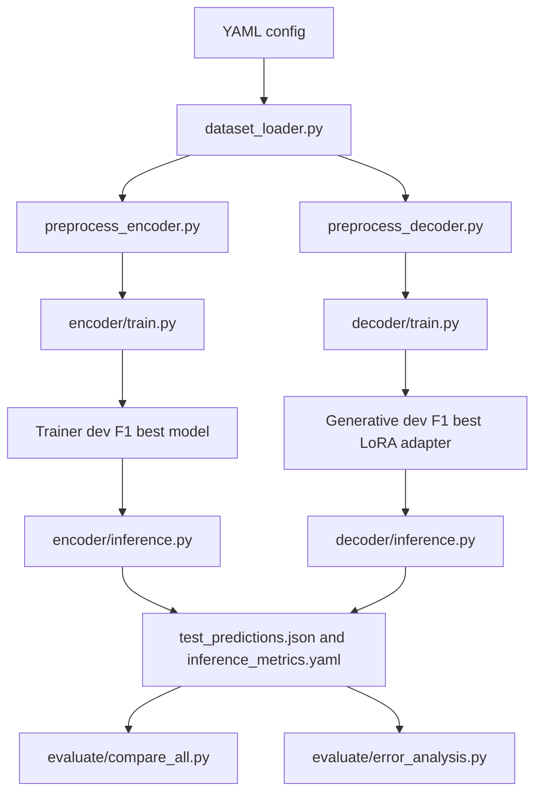

# 1. Project Overview

This repository contains the experimental code for a bachelor thesis project on Named Entity Recognition (NER). NER is the task of finding spans in text that refer to named entities and assigning each span an entity type. For example, a system may label "Berlin" as a location or "Qwen" as a product or organization depending on the dataset taxonomy.

The project compares two different ways to solve NER:

| Paradigm | Implementation in this project | Output form |
| --- | --- | --- |
| Encoder-based token classification | DeBERTa models with a token classification head | BIO tags, one label per input token |
| Generative LLM-based NER | Qwen3.5 causal language models fine-tuned with LoRA/QLoRA | JSON-like structured entity lists generated from prompts |

The final supported model families are:

| Family | Supported models |
| --- | --- |
| Encoder | `microsoft/deberta-v3-base`, `microsoft/deberta-v3-large` |
| LLM / decoder | `Qwen/Qwen3.5-4B`, `Qwen/Qwen3.5-27B` |

The final supported datasets are:

| Dataset | Role | Notes |
| --- | --- | --- |
| `Babelscape/multinerd` | Main benchmark | English subset only, selected by `lang == "en"` |
| `wnut_17` | Secondary benchmark | Social-media NER dataset with a smaller entity taxonomy |

The repository is designed for controlled experimental comparison. It trains models, selects checkpoints, runs test-set inference, measures entity-level metrics, records efficiency metrics, and generates comparison artifacts.

Most commands in this README assume that the working directory is `ba-ner/`:

```bash
cd ba-ner
```

# 2. Research Goal

The research goal is to compare encoder-based NER and LLM-based generative NER under a shared experimental framework.

Encoder models such as DeBERTa treat NER as token-level sequence labeling. The model receives tokenized text and predicts one label per token, usually in BIO format:

```text
Berlin is cold
B-LOC  O  O
```

Generative LLMs treat NER as structured text generation. The model receives an instruction and an input sentence, then generates a JSON list:

```json
[{"entity": "Berlin", "type": "LOC"}]
```

The project measures:

| Measurement | Why it matters |
| --- | --- |
| Entity-level precision, recall, and F1 | Core task quality; a span is correct only if the boundaries and type match |
| Per-entity-type F1 | Shows which entity categories are easy or difficult |
| Training runtime | Important for experimental cost and reproducibility |
| Inference latency | Important if the model must be used interactively or at scale |
| VRAM peak | Determines hardware feasibility |
| Trainable and total parameters | Shows the difference between full fine-tuning and parameter-efficient LoRA |
| Parse failure rate for LLMs | Measures output robustness of generative structured prediction |

Output robustness and efficiency are central because LLM-based NER is not only a question of F1. A generated answer must also be parseable, use the expected schema, use the expected entity taxonomy, and refer to spans that actually occur in the input text. Encoder token classifiers avoid JSON parsing, but they are limited to the fixed label space in the classification head.

# 3. Final Experimental Setup

The final supported setup is intentionally narrow. Removed legacy experiments should not be treated as current.

## Encoder Models

| Config | Hugging Face model | Experiment name | Main output directory |
| --- | --- | --- | --- |
| `configs/deberta_base.yaml` | `microsoft/deberta-v3-base` | `deberta-v3-base` | `results/multinerd/deberta-v3-base/` |
| `configs/deberta_large.yaml` | `microsoft/deberta-v3-large` | `deberta-v3-large` | `results/multinerd/deberta-v3-large/` |

Both encoder configs default to the MultiNERD English benchmark. They can be run on WNUT-17 by passing `--dataset wnut_17`.

## LLM Models

| Config | Hugging Face model | Experiment name | Main output directory |
| --- | --- | --- | --- |
| `configs/qwen35_4b.yaml` | `Qwen/Qwen3.5-4B` | `qwen35-4b-qlora` | `results/multinerd/qwen35-4b-qlora/` |
| `configs/qwen35_27b.yaml` | `Qwen/Qwen3.5-27B` | `qwen35-27b-qlora` | `results/multinerd/qwen35-27b-qlora/` |

Both active Qwen configs use QLoRA by default (`use_qlora: true`) and set `attn_impl: sdpa`.

## Datasets

| Dataset name in config/CLI | Hugging Face dataset | Role | Entity taxonomy |
| --- | --- | --- | --- |
| `multinerd` | `Babelscape/multinerd` | Main benchmark | 15 entity types, 31 BIO labels |
| `wnut_17` | `wnut_17` | Secondary benchmark | 6 entity types, 13 BIO labels |

The main benchmark is the full final model setup on MultiNERD English:

```text
deberta-v3-base
deberta-v3-large
qwen35-4b-qlora
qwen35-27b-qlora
```

The secondary benchmark is WNUT-17. `scripts/run_all.py --wnut17` runs a smaller WNUT-specific benchmark with:

```text
deberta-v3-base
qwen35-4b-qlora
```

The individual training and inference CLIs also accept `--dataset wnut_17`, so additional WNUT-17 runs can be launched manually if the hardware budget allows.

The old configs for `bert-base-cased` and `Qwen/Qwen3-14B` are not present in the current active config directory and should be considered removed.

# 4. Codebase Architecture

The runnable package is under `ba-ner/`.

```text
ba-ner/
  configs/          YAML experiment configs
  scripts/          Pipeline orchestration and SLURM helper scripts
  src/data/         Dataset loading and preprocessing
  src/encoder/      DeBERTa token-classification training and inference
  src/decoder/      Qwen3.5 LoRA/QLoRA training, inference, and output parsing
  src/evaluate/     Metrics, efficiency utilities, comparison, and error analysis
  results/          Runtime output directory
  requirements.txt  Python dependency list
  setup.py          Editable package setup
```

The central architectural idea is that both datasets are exposed through one dataset abstraction in `src/data/dataset_loader.py`. The encoder and decoder pipelines use the same raw dataset interface, but they preprocess it differently:

| Pipeline | Preprocessing target |
| --- | --- |
| Encoder | Tokenized features plus aligned BIO labels |
| Decoder | Chat-style messages with a system prompt, user sentence, and JSON assistant answer |

The current result layout is:

```text
results/<dataset>/<experiment>/
```

Examples:

```text
results/multinerd/deberta-v3-base/
results/multinerd/qwen35-4b-qlora/
results/wnut_17/deberta-v3-base/
results/wnut_17/qwen35-4b-qlora/
```

## Information Flow



The important checkpoint-selection difference is:

| Pipeline | Selection mechanism |
| --- | --- |
| Encoder | Hugging Face `Trainer` selects the best checkpoint by validation F1 with `load_best_model_at_end: true` |
| Decoder / LLM | A custom generative dev evaluation callback generates entity lists, parses them, computes dev F1, and stores the best adapter in `best_lora_adapter/` |

For the decoder, teacher-forced `eval_loss` is not used as the final best-model criterion. This is intentional because the final task is generative structured prediction, not only next-token loss under the gold answer.

# 5. Detailed File and Folder Reference

## Repository Root

| Path | Role | Inputs | Outputs / effects |
| --- | --- | --- | --- |
| `README.md` | Project documentation | Repository state and implementation | Documentation only |
| `LICENSE` | Project license | None | License text |
| `.gitignore` | Top-level ignore rules | None | General Python ignore behavior |
| `ba-ner/` | Python project root | Source code, configs, scripts | Training and evaluation commands should usually be run from here |

## `configs/`

The configs control model identity, dataset choice, hyperparameters, LoRA settings, checkpointing, and output paths.

| File | Role | Important inputs | Outputs / connections |
| --- | --- | --- | --- |
| `configs/deberta_base.yaml` | DeBERTa-v3-base encoder experiment | `model_name: microsoft/deberta-v3-base`, `dataset: multinerd`, `max_length: 256`, training hyperparameters | Used by `src.encoder.train` and `src.encoder.inference`; defaults to `results/multinerd/deberta-v3-base/` |
| `configs/deberta_large.yaml` | DeBERTa-v3-large encoder experiment | `model_name: microsoft/deberta-v3-large`, lower batch size and learning rate than base | Used by encoder training/inference; defaults to `results/multinerd/deberta-v3-large/` |
| `configs/qwen35_4b.yaml` | Qwen3.5-4B decoder experiment | `model_name: Qwen/Qwen3.5-4B`, `use_qlora: true`, LoRA rank 16, `max_seq_length: 1024` | Used by decoder training/inference; defaults to `results/multinerd/qwen35-4b-qlora/` |
| `configs/qwen35_27b.yaml` | Qwen3.5-27B decoder experiment | `model_name: Qwen/Qwen3.5-27B`, `use_qlora: true`, LoRA rank 32, smaller per-device batch size | Used by decoder training/inference; defaults to `results/multinerd/qwen35-27b-qlora/` |

The dataset can be overridden at runtime:

```bash
python -m src.encoder.train configs/deberta_base.yaml --dataset wnut_17
python -m src.decoder.train configs/qwen35_4b.yaml --dataset wnut_17
```

When `--dataset` is used, the code rewrites the output path to:

```text
results/<dataset_override>/<experiment_name>/
```

## `src/data/`

| File | Role | Inputs | Outputs / connections |
| --- | --- | --- | --- |
| `src/data/dataset_loader.py` | Central dataset entry point | Dataset name (`multinerd` or `wnut_17`) and optional language (`en` by default) | Returns `(DatasetDict, DatasetInfo)` with `tokens`, `ner_tags`, label mappings, entity types, and label counts |
| `src/data/preprocess_encoder.py` | Encoder preprocessing | Raw dataset from `dataset_loader.py`, encoder tokenizer, `max_length` | Tokenized `DatasetDict` with `input_ids`, `attention_mask`, optional `token_type_ids`, and aligned `labels` |
| `src/data/preprocess_decoder.py` | Decoder preprocessing | Raw dataset from `dataset_loader.py`, entity types, label mappings | Chat-style `messages` datasets for SFT; inference prompts and gold entity lists |
| `src/data/load_wnut17.py` | Older WNUT-17 inspection helper | Direct `load_dataset("wnut_17")` call | Prints WNUT-17 stats and examples when run directly; no longer the central dataset abstraction |
| `src/data/__init__.py` | Package marker | None | Allows `src.data` imports |

`dataset_loader.py` is the main data entry point for current training and inference. `load_wnut17.py` still exists, but it is dataset-specific and should be treated as an inspection/legacy helper rather than the shared data-loading layer.

## `src/encoder/`

| File | Role | Inputs | Outputs / connections |
| --- | --- | --- | --- |
| `src/encoder/train.py` | Trains a DeBERTa token classifier | YAML config, optional `--dataset` override | Saves checkpoints, `best_model/`, and `results.yaml` in `results/<dataset>/<experiment>/` |
| `src/encoder/inference.py` | Runs test-set inference for a saved encoder model | `--model`, `--config`, optional `--dataset` | Saves `test_predictions.json` and `inference_metrics.yaml` |
| `src/encoder/__init__.py` | Package marker | None | Allows `src.encoder` imports |

The encoder path uses `AutoModelForTokenClassification`, `DataCollatorForTokenClassification`, and Hugging Face `Trainer`.

## `src/decoder/`

| File | Role | Inputs | Outputs / connections |
| --- | --- | --- | --- |
| `src/decoder/train.py` | Fine-tunes Qwen3.5 with LoRA/QLoRA via TRL `SFTTrainer` | YAML config, optional `--dataset` override | Saves epoch checkpoints, `best_lora_adapter/`, `lora_adapter/`, and `results.yaml` |
| `src/decoder/inference.py` | Runs generative test-set inference with a base model plus adapter | `--adapter`, `--base`, `--config`, optional `--dataset` | Saves `test_predictions.json` and `inference_metrics.yaml` |
| `src/decoder/parse_output.py` | Parses generated LLM outputs and converts entity lists to BIO tags | Raw generated text, valid entity type set, tokens | Returns parsed entities, parse status, BIO sequences, and LLM evaluation metrics |
| `src/decoder/__init__.py` | Package marker | None | Allows `src.decoder` imports |

The decoder path expects the model to generate a JSON list of entity dictionaries. Parsing is deliberately separated into `parse_output.py` so parse failures and fallback behavior can be analyzed.

## `src/evaluate/`

| File | Role | Inputs | Outputs / connections |
| --- | --- | --- | --- |
| `src/evaluate/metrics.py` | Shared seqeval-based NER metrics | Gold and predicted BIO sequences | Precision, recall, F1, classification reports, per-type metrics, macro F1 |
| `src/evaluate/efficiency.py` | Efficiency utilities | PyTorch models and inference functions | Parameter counts, VRAM peak measurement, latency measurement helpers |
| `src/evaluate/error_analysis.py` | Qualitative error categorization | Encoder and/or decoder `test_predictions.json` files | Prints a Rich summary table; does not write a file by default |
| `src/evaluate/compare_all.py` | Aggregates result folders and creates plots/tables | `results/` directory with `results.yaml`, `inference_metrics.yaml`, and optionally `test_predictions.json` | Terminal comparison table, `comparison_f1.pdf`, `per_entity_heatmap_<dataset>.pdf`, and `comparison_table.tex` |
| `src/evaluate/__init__.py` | Package marker | None | Allows `src.evaluate` imports |

`compare_all.py` recognizes both the current multi-dataset layout and an older legacy layout directly under `results/<experiment>/`.

## `scripts/`

| File | Role | Inputs | Outputs / connections |
| --- | --- | --- | --- |
| `scripts/run_all.py` | Python orchestrator for sequential experiments | CLI flags such as `--encoder-only`, `--decoder-only`, `--model`, `--wnut17`, `--skip-train`, `--skip-inference` | Calls training, inference, and comparison stages |
| `scripts/run_encoder.sh` | SLURM/local helper for encoder runs | A conda environment named `ba-ner`, GPU allocation in SBATCH settings | Runs DeBERTa MultiNERD training/inference and DeBERTa-base WNUT-17 training/inference |
| `scripts/run_decoder.sh` | SLURM/local helper for decoder runs | A conda environment named `ba-ner`, A100-style GPU allocation in SBATCH settings | Runs Qwen3.5 MultiNERD training/inference and Qwen3.5-4B WNUT-17 training/inference |

The shell scripts are not required to use the project. They encode one cluster-oriented run plan and assume `source activate ba-ner`.

## `results/`

`results/` is the runtime output tree. It is mostly empty in a fresh checkout, except for `.gitkeep`. Training and inference create subdirectories such as:

```text
results/multinerd/deberta-v3-base/
results/multinerd/deberta-v3-large/
results/multinerd/qwen35-4b-qlora/
results/multinerd/qwen35-27b-qlora/
results/wnut_17/deberta-v3-base/
results/wnut_17/qwen35-4b-qlora/
```

`ba-ner/.gitignore` ignores common large tensor extensions such as `*.safetensors`, `*.bin`, and `*.pt`. Some result-directory ignore patterns still look like older one-level result paths, so check `git status` before committing generated artifacts from the current nested `results/<dataset>/<experiment>/` layout.

## Package and Dependency Files

| File | Role | Notes |
| --- | --- | --- |
| `setup.py` | Minimal editable package setup | Package name is `ba-ner`; requires Python `>=3.10`; uses `find_packages()` |
| `requirements.txt` | Runtime dependency list | Includes PyTorch, Transformers, Datasets, Accelerate, PEFT, TRL, bitsandbytes, seqeval, scikit-learn, wandb, PyYAML, Rich, Matplotlib, pandas, flash-attn, and NumPy |
| `ba-ner/.gitignore` | Project-specific ignore rules | Ignores logs, W&B output, virtual environments, large tensor file extensions, and some older one-level result checkpoint/adapter paths |

# 6. Dataset Handling

The central data loader is `src/data/dataset_loader.py`. It defines a `DatasetInfo` dataclass that carries the metadata needed by both pipelines:

| Field | Meaning |
| --- | --- |
| `name` | Short dataset name such as `multinerd` or `wnut_17` |
| `hf_name` | Hugging Face dataset identifier |
| `label_list` | Ordered BIO label list |
| `id2label` | Integer label ID to BIO label string |
| `label2id` | BIO label string to integer label ID |
| `entity_types` | Entity types without the `B-` or `I-` prefix |
| `num_labels` | Number of labels for the encoder classification head |

## MultiNERD

For MultiNERD, the loader calls:

```python
load_dataset("Babelscape/multinerd")
```

It then filters the dataset with:

```python
x["lang"] == language
```

The default language is `en`. After filtering, it removes the `lang` column. The downstream code expects the remaining dataset splits to contain at least:

```text
tokens
ner_tags
```

The MultiNERD label taxonomy in the current loader contains 15 entity types:

```text
PER, ORG, LOC, ANIM, BIO, CEL, DIS, EVE, FOOD, INST, MEDIA, MYTH, PLANT, TIME, VEHI
```

These become 31 BIO labels including `O`.

## WNUT-17

For WNUT-17, the loader calls:

```python
load_dataset("wnut_17")
```

No language filtering is applied. The WNUT-17 label taxonomy contains 6 entity types:

```text
corporation, creative-work, group, location, person, product
```

These become 13 BIO labels including `O`.

## Encoder vs. Decoder Preprocessing

The raw dataset abstraction is shared, but preprocessing is different:

| Pipeline | File | Transformation |
| --- | --- | --- |
| Encoder | `preprocess_encoder.py` | Tokenizes pre-split words with a fast tokenizer and aligns word-level BIO labels to subword tokens |
| Decoder | `preprocess_decoder.py` | Converts BIO labels into entity dictionaries and builds chat-style messages for SFT |

For encoders, subword alignment uses the first subword of each word only. Special tokens and later subwords receive label ID `-100`, which PyTorch's cross-entropy loss and seqeval-style filtering ignore.

For decoders, the system prompt is built dynamically from the dataset's entity types. This keeps the prompt aligned with MultiNERD or WNUT-17 without hard-coding one taxonomy in the training code.

Dataset-specific assumptions that still exist:

| Assumption | Where it appears |
| --- | --- |
| MultiNERD has a `lang` column | `dataset_loader.py` filters and removes it |
| Both supported datasets provide `tokens` and `ner_tags` | `dataset_loader.py` validates these columns |
| Decoder span extraction joins tokens with spaces | `preprocess_decoder.py` and `parse_output.py` use whitespace-based entity text |
| WNUT-specific inspection code remains | `load_wnut17.py`, but it is not the central loader |

# 7. Encoder Pipeline

The encoder pipeline is implemented in `src/encoder/train.py` and `src/encoder/inference.py`.

## Training

A typical command is:

```bash
python -m src.encoder.train configs/deberta_base.yaml
```

The training flow is:

1. Load the YAML config.
2. Apply the optional dataset override if `--dataset` is provided.
3. Set random seeds in `transformers`, `random`, `numpy`, and `torch`.
4. Load and preprocess the dataset through `prepare_encoder_dataset()`.
5. Load `AutoModelForTokenClassification` with dataset-specific `num_labels`, `id2label`, and `label2id`.
6. Configure Hugging Face `TrainingArguments`.
7. Train with `Trainer`.
8. Select the best checkpoint by validation F1 through the Trainer.
9. Save the best model and tokenizer under `best_model/`.
10. Evaluate on the test split.
11. Write `results.yaml`.

The model receives:

```text
input_ids
attention_mask
labels
optional token_type_ids
```

The classifier head predicts one label per token position. Labels set to `-100` are ignored.

## Subword Alignment

The dataset starts as word-level tokens and word-level BIO tags. The tokenizer may split one word into multiple subword pieces. The implementation uses this rule:

| Token position | Label used for loss/evaluation |
| --- | --- |
| First subword of a word | Original BIO label |
| Later subwords of the same word | `-100` |
| Special tokens and padding | `-100` |

This avoids double-counting a word when computing the loss or seqeval metrics.

## Best Model Selection

The active encoder configs set:

```yaml
load_best_model_at_end: true
metric_for_best_model: f1
greater_is_better: true
```

The `Trainer` evaluates on the validation split at the configured interval, currently per epoch. At the end, it loads the best checkpoint according to validation F1. `trainer.save_model(best_model_dir)` then writes that selected model to:

```text
results/<dataset>/<experiment>/best_model/
```

## Encoder Inference

A typical command is:

```bash
python -m src.encoder.inference \
  --model results/multinerd/deberta-v3-base/best_model \
  --config configs/deberta_base.yaml
```

For WNUT-17:

```bash
python -m src.encoder.inference \
  --model results/wnut_17/deberta-v3-base/best_model \
  --config configs/deberta_base.yaml \
  --dataset wnut_17
```

Inference reloads the saved model and tokenizer, preprocesses the test split in the same way as training, runs one sample at a time, decodes predictions back to BIO labels, and writes:

```text
results/<dataset>/<experiment>/test_predictions.json
results/<dataset>/<experiment>/inference_metrics.yaml
```

The encoder `test_predictions.json` schema is:

```json
[
  {
    "tokens": ["..."],
    "gold": ["O", "B-LOC"],
    "pred": ["O", "B-LOC"]
  }
]
```

# 8. Decoder / LLM Pipeline

The decoder pipeline is implemented in `src/decoder/train.py`, `src/decoder/inference.py`, and `src/decoder/parse_output.py`.

## Training Format

NER is reformulated as chat-style structured generation. Each training sample becomes a `messages` list:

```json
[
  {"role": "system", "content": "You are a Named Entity Recognition (NER) system..."},
  {"role": "user", "content": "input sentence"},
  {"role": "assistant", "content": "[{\"entity\": \"Berlin\", \"type\": \"LOC\"}]"}
]
```

The system prompt is generated from the active dataset's entity types. The assistant answer is created by converting the gold BIO sequence into entity dictionaries.

## LoRA and QLoRA Configuration

Both active Qwen configs use QLoRA by default:

```yaml
use_qlora: true
attn_impl: sdpa
```

When `use_qlora` is true, the code loads the base model with `BitsAndBytesConfig`:

```text
4-bit loading
NF4 quantization by default
bfloat16 compute dtype
```

The LoRA modules are configured from the YAML field `target_modules`. The active configs target:

```text
q_proj, k_proj, v_proj, o_proj, gate_proj, up_proj, down_proj
```

The smaller Qwen3.5-4B config uses LoRA rank 16. The larger Qwen3.5-27B config uses LoRA rank 32.

The decoder training config uses TRL `SFTTrainer` and sets:

```yaml
load_best_model_at_end: false
```

This is intentional. Best-model selection is handled by a custom generative dev evaluation callback rather than by teacher-forced loss.

## Generative Dev Evaluation

After each evaluation event, the custom `GenerativeDevEvalCallback`:

1. Runs `model.generate()` on validation prompts.
2. Removes the prompt tokens from the generated output.
3. Decodes only the newly generated text.
4. Parses the generated JSON-like answer with `parse_llm_output()`.
5. Converts predicted and gold entities into BIO tags.
6. Computes entity-level precision, recall, and F1.
7. Saves the adapter if this generative dev F1 is the best so far.

The number of validation samples used for this generative check is controlled by:

```yaml
gen_eval_max_samples: 200
```

The best adapter is saved to:

```text
results/<dataset>/<experiment>/best_lora_adapter/
```

The final adapter at the end of training is saved separately to:

```text
results/<dataset>/<experiment>/lora_adapter/
```

If no best adapter exists for any reason, the training result metadata falls back to the last adapter directory.

## Parser Behavior

`src/decoder/parse_output.py` expects output like:

```json
[{"entity": "Barack Obama", "type": "PER"}]
```

It applies these parsing strategies:

| Status | Meaning |
| --- | --- |
| `ok` | Direct JSON parsing succeeded |
| `markdown_stripped` | JSON was parsed after removing a Markdown code fence |
| `regex_fallback` | JSON array was parsed after extracting the first bracketed array |
| `failed` | No valid JSON list could be parsed |

Before parsing, the parser strips `<think>...</think>` blocks. It also validates entity dictionaries and filters unknown entity types when a valid type set is provided.

The conversion from entity dictionaries back to BIO tags uses exact whitespace token matching. This is simple and transparent, but it means that generated spans with different casing, punctuation spacing, or paraphrasing may fail to align to the original token list.

## Decoder Inference

A typical command is:

```bash
python -m src.decoder.inference \
  --adapter results/multinerd/qwen35-4b-qlora/best_lora_adapter \
  --base Qwen/Qwen3.5-4B \
  --config configs/qwen35_4b.yaml
```

For WNUT-17:

```bash
python -m src.decoder.inference \
  --adapter results/wnut_17/qwen35-4b-qlora/best_lora_adapter \
  --base Qwen/Qwen3.5-4B \
  --config configs/qwen35_4b.yaml \
  --dataset wnut_17
```

The decoder inference output is:

```text
results/<dataset>/<experiment>/test_predictions.json
results/<dataset>/<experiment>/inference_metrics.yaml
```

The decoder `test_predictions.json` schema is:

```json
[
  {
    "tokens": ["..."],
    "gold_entities": [{"entity": "...", "type": "..."}],
    "pred_entities": [{"entity": "...", "type": "..."}],
    "raw_output": "[...]",
    "parse_status": "ok",
    "gold_bio": ["O", "B-LOC"],
    "pred_bio": ["O", "B-LOC"]
  }
]
```

# 9. Configuration System

Each experiment is controlled by one YAML file in `configs/`.

## Common Fields

| Field | Used by | Meaning |
| --- | --- | --- |
| `experiment_name` | All pipelines | Directory name inside `results/<dataset>/` |
| `model_name` | All pipelines | Hugging Face model ID |
| `model_type` | All pipelines | `encoder` or `decoder` |
| `dataset` | All pipelines | Default dataset, currently `multinerd` in active configs |
| `dataset_language` | Dataset loader | Language filter for MultiNERD, default `en` |
| `seed` | Training | Random seed |
| `output_dir` | Training/inference | Default output path |
| `use_wandb` | Training | Whether to report to W&B |

## Encoder Fields

| Field | Meaning |
| --- | --- |
| `max_length` | Maximum tokenizer length |
| `learning_rate` | Optimizer learning rate |
| `num_train_epochs` | Number of training epochs |
| `per_device_train_batch_size` | Per-device train batch size |
| `per_device_eval_batch_size` | Per-device eval batch size |
| `gradient_accumulation_steps` | Accumulation steps before optimizer update |
| `weight_decay` | Weight decay |
| `warmup_ratio` | LR warmup fraction |
| `lr_scheduler_type` | LR scheduler |
| `eval_strategy` | Evaluation interval, currently epoch-based |
| `save_strategy` | Checkpoint save interval |
| `save_total_limit` | Maximum number of checkpoints retained |
| `load_best_model_at_end` | Enables Trainer best checkpoint loading |
| `metric_for_best_model` | Metric used for best checkpoint selection |
| `greater_is_better` | Direction for best metric |
| `early_stopping_patience` | Early stopping patience |

Although the encoder configs contain `fp16: true`, the current code chooses mixed precision based on hardware: it prefers bf16 if CUDA bf16 is supported and otherwise uses fp16 on CUDA.

## Decoder Fields

| Field | Meaning |
| --- | --- |
| `use_qlora` | Whether to load the base model in 4-bit mode |
| `attn_impl` | Attention implementation passed to Transformers, currently `sdpa` |
| `lora_r` | LoRA rank |
| `lora_alpha` | LoRA alpha |
| `lora_dropout` | LoRA dropout |
| `target_modules` | Module names that receive LoRA adapters |
| `max_seq_length` | Maximum sequence length for SFT |
| `packing` | TRL SFT packing flag |
| `gradient_checkpointing` | Whether gradient checkpointing is enabled |
| `gen_eval_max_samples` | Max validation samples for generative dev evaluation per epoch |

## Switching Datasets

The config default is MultiNERD English. To switch to WNUT-17 without editing the config:

```bash
python -m src.encoder.train configs/deberta_base.yaml --dataset wnut_17
python -m src.decoder.train configs/qwen35_4b.yaml --dataset wnut_17
```

The same override must be used at inference time so the correct label taxonomy and output directory are used:

```bash
python -m src.encoder.inference \
  --model results/wnut_17/deberta-v3-base/best_model \
  --config configs/deberta_base.yaml \
  --dataset wnut_17
```

Current configs:

```text
configs/deberta_base.yaml
configs/deberta_large.yaml
configs/qwen35_4b.yaml
configs/qwen35_27b.yaml
```

Legacy configs for `bert-base-cased` and `Qwen/Qwen3-14B` are removed from the current config directory.

# 10. How to Run the Project

These commands are documentation examples. They are not run automatically.

## Environment Setup

From the repository root:

```bash
cd ba-ner
python -m venv .venv
source .venv/bin/activate
pip install -e .
pip install -r requirements.txt
```

The project requires Python `>=3.10`.

On a cluster, the shell scripts assume a conda environment named `ba-ner`:

```bash
source activate ba-ner
```

If you use a different environment name, either activate it manually before running Python commands or adapt the shell scripts.

## Inspect WNUT-17 Directly

This helper is specific to WNUT-17 and is not the central loader:

```bash
python -m src.data.load_wnut17
```

The current central data path for experiments is `src.data.dataset_loader`.

## Run Encoder Training

MultiNERD English:

```bash
python -m src.encoder.train configs/deberta_base.yaml
python -m src.encoder.train configs/deberta_large.yaml
```

WNUT-17:

```bash
python -m src.encoder.train configs/deberta_base.yaml --dataset wnut_17
python -m src.encoder.train configs/deberta_large.yaml --dataset wnut_17
```

## Run Encoder Inference

MultiNERD English:

```bash
python -m src.encoder.inference \
  --model results/multinerd/deberta-v3-base/best_model \
  --config configs/deberta_base.yaml
```

WNUT-17:

```bash
python -m src.encoder.inference \
  --model results/wnut_17/deberta-v3-base/best_model \
  --config configs/deberta_base.yaml \
  --dataset wnut_17
```

## Run Decoder Training

MultiNERD English:

```bash
python -m src.decoder.train configs/qwen35_4b.yaml
python -m src.decoder.train configs/qwen35_27b.yaml
```

WNUT-17:

```bash
python -m src.decoder.train configs/qwen35_4b.yaml --dataset wnut_17
python -m src.decoder.train configs/qwen35_27b.yaml --dataset wnut_17
```

The second WNUT-17 command is supported by the CLI, but it is not part of the smaller WNUT mode in `scripts/run_all.py`.

## Run Decoder Inference

MultiNERD English:

```bash
python -m src.decoder.inference \
  --adapter results/multinerd/qwen35-4b-qlora/best_lora_adapter \
  --base Qwen/Qwen3.5-4B \
  --config configs/qwen35_4b.yaml
```

Qwen3.5-27B on MultiNERD:

```bash
python -m src.decoder.inference \
  --adapter results/multinerd/qwen35-27b-qlora/best_lora_adapter \
  --base Qwen/Qwen3.5-27B \
  --config configs/qwen35_27b.yaml
```

WNUT-17:

```bash
python -m src.decoder.inference \
  --adapter results/wnut_17/qwen35-4b-qlora/best_lora_adapter \
  --base Qwen/Qwen3.5-4B \
  --config configs/qwen35_4b.yaml \
  --dataset wnut_17
```

## Run the Full Pipeline

Main MultiNERD benchmark:

```bash
python scripts/run_all.py
```

Only encoders:

```bash
python scripts/run_all.py --encoder-only
```

Only decoders:

```bash
python scripts/run_all.py --decoder-only
```

Only comparison, assuming result files already exist:

```bash
python scripts/run_all.py --eval-only
```

One model:

```bash
python scripts/run_all.py --model deberta_base
python scripts/run_all.py --model deberta_large
python scripts/run_all.py --model qwen35_4b
python scripts/run_all.py --model qwen35_27b
```

Skip training or inference:

```bash
python scripts/run_all.py --skip-train
python scripts/run_all.py --skip-inference
```

WNUT-17 secondary benchmark mode:

```bash
python scripts/run_all.py --wnut17
```

This WNUT-17 mode runs only `deberta_base` and `qwen35_4b`.

## SLURM Usage

Encoder script:

```bash
sbatch scripts/run_encoder.sh
```

Decoder script:

```bash
sbatch scripts/run_decoder.sh
```

The SLURM scripts request GPU resources and write logs to:

```text
logs/encoder_<jobid>.log
logs/encoder_<jobid>.err
logs/decoder_<jobid>.log
logs/decoder_<jobid>.err
```

The scripts assume that the `ba-ner` conda environment exists.

## Run Comparison

All datasets in `results/`:

```bash
python -m src.evaluate.compare_all
```

Specific dataset:

```bash
python -m src.evaluate.compare_all --dataset multinerd
python -m src.evaluate.compare_all --dataset wnut_17
```

Custom results directory:

```bash
python -m src.evaluate.compare_all --results-dir results
```

## Run Error Analysis

MultiNERD example:

```bash
python -m src.evaluate.error_analysis \
  --encoder-preds results/multinerd/deberta-v3-large/test_predictions.json \
  --decoder-preds results/multinerd/qwen35-27b-qlora/test_predictions.json \
  --dataset multinerd
```

WNUT-17 example:

```bash
python -m src.evaluate.error_analysis \
  --encoder-preds results/wnut_17/deberta-v3-base/test_predictions.json \
  --decoder-preds results/wnut_17/qwen35-4b-qlora/test_predictions.json \
  --dataset wnut_17
```

The current CLI prints a summary table and does not write an error-analysis file by default.

# 11. Output Structure and How to Interpret Results

All current experiment artifacts use:

```text
results/<dataset>/<experiment>/
```

For example:

```text
results/multinerd/deberta-v3-base/
results/multinerd/qwen35-4b-qlora/
results/wnut_17/deberta-v3-base/
```

## Encoder Artifacts

```text
results/<dataset>/<deberta-experiment>/
  checkpoint-*/
  best_model/
  results.yaml
  test_predictions.json
  inference_metrics.yaml
```

| Artifact | Produced by | Meaning |
| --- | --- | --- |
| `checkpoint-*/` | Hugging Face Trainer during training | Intermediate checkpoints retained according to `save_total_limit` |
| `best_model/` | `src.encoder.train` | Best validation-F1 model selected by Trainer and saved for later inference |
| `results.yaml` | `src.encoder.train` | Training summary plus test metrics from the training-time test evaluation |
| `test_predictions.json` | `src.encoder.inference` | Token-level BIO gold/pred sequences for the test split |
| `inference_metrics.yaml` | `src.encoder.inference` | Test F1/precision/recall plus latency, VRAM peak, and parameter count |

Encoder `results.yaml` includes fields such as:

```text
experiment_name
model_name
model_type: encoder
dataset
test_f1
test_precision
test_recall
train_runtime_seconds
best_model_dir
seed
num_train_epochs
learning_rate
per_device_train_batch_size
max_length
```

## Decoder Artifacts

```text
results/<dataset>/<qwen-experiment>/
  checkpoint-*/
  best_lora_adapter/
  lora_adapter/
  results.yaml
  test_predictions.json
  inference_metrics.yaml
```

| Artifact | Produced by | Meaning |
| --- | --- | --- |
| `checkpoint-*/` | TRL `SFTTrainer` | Intermediate training checkpoints |
| `best_lora_adapter/` | Generative dev evaluation callback | Best adapter according to generated validation entity F1 |
| `lora_adapter/` | End of `src.decoder.train` | Final adapter after the last training epoch; useful fallback |
| `results.yaml` | `src.decoder.train` | Training summary, best generative dev F1, best epoch, and adapter paths |
| `test_predictions.json` | `src.decoder.inference` | Generated raw outputs, parse statuses, entity lists, and BIO conversions |
| `inference_metrics.yaml` | `src.decoder.inference` | Test F1/precision/recall, parse failure stats, latency, VRAM peak, and parameter count |

Decoder `results.yaml` includes fields such as:

```text
experiment_name
model_name
model_type: decoder
dataset
use_qlora
lora_r
lora_alpha
train_runtime_seconds
trainable_params
total_params
best_dev_f1
best_epoch
epoch_results
best_adapter_dir
last_adapter_dir
seed
```

`best_lora_adapter/` is the recommended adapter for final inference because it is selected by generated validation output, not by teacher-forced `eval_loss`.

## Prediction Files

Encoder prediction files are BIO-based:

```json
{
  "tokens": ["Token", "list"],
  "gold": ["O", "B-LOC"],
  "pred": ["O", "B-LOC"]
}
```

Decoder prediction files preserve more information:

```json
{
  "tokens": ["Token", "list"],
  "gold_entities": [{"entity": "Token", "type": "LOC"}],
  "pred_entities": [{"entity": "Token", "type": "LOC"}],
  "raw_output": "[...]",
  "parse_status": "ok",
  "gold_bio": ["B-LOC", "O"],
  "pred_bio": ["B-LOC", "O"]
}
```

Use `raw_output` and `parse_status` to diagnose generative formatting problems. Use `gold_bio` and `pred_bio` to compare decoder outputs through the same seqeval metric family as encoder outputs.

## Metrics Files

`inference_metrics.yaml` is the main file for final test-set comparison. For encoders it contains:

```text
test_f1
test_precision
test_recall
latency_ms_mean
latency_ms_p95
vram_peak_mb
total_params
```

For decoders it also contains parse metrics:

```text
parse_failure_rate
parse_ok
parse_markdown_stripped
parse_regex_fallback
parse_failed
```

When comparing final models, prefer the inference metrics because they are produced by the explicit inference scripts and include efficiency measurements.

## Comparison Artifacts

`src.evaluate.compare_all` writes:

| Artifact | Meaning |
| --- | --- |
| `results/comparison_f1.pdf` | Horizontal bar plot of entity-level F1 scores |
| `results/per_entity_heatmap_multinerd.pdf` | Per-entity-type F1 heatmap for MultiNERD, if predictions exist |
| `results/per_entity_heatmap_wnut_17.pdf` | Per-entity-type F1 heatmap for WNUT-17, if predictions exist |
| `results/comparison_table.tex` | LaTeX table for reporting model comparisons |
| Terminal Rich table | Human-readable sorted comparison table |

The heatmap requires `test_predictions.json` because per-entity metrics are computed from BIO sequences.

## Error Analysis Outputs

`src.evaluate.error_analysis` reads saved prediction files and prints a table with categories such as:

| Encoder categories | Decoder categories |
| --- | --- |
| Missed entities | JSON parse failures |
| Hallucinated entities | Incomplete JSON |
| Boundary errors | Wrong schema |
| Type errors | Missing fields |
|  | Unknown entity types |
|  | Span mismatches |

The current CLI prints this table to the terminal only. It does not persist a JSON, YAML, or PDF artifact by default.

## Logs

Local Python commands print progress and metrics to the console through Rich. The SLURM shell scripts write stdout/stderr to:

```text
logs/encoder_<jobid>.log
logs/encoder_<jobid>.err
logs/decoder_<jobid>.log
logs/decoder_<jobid>.err
```

# 12. Typical End-to-End Workflow

A practical MultiNERD workflow:

1. Choose a config:

```bash
cd ba-ner
```

```text
configs/deberta_base.yaml
configs/deberta_large.yaml
configs/qwen35_4b.yaml
configs/qwen35_27b.yaml
```

2. Choose a dataset:

```text
multinerd
wnut_17
```

3. Train the model:

```bash
python -m src.encoder.train configs/deberta_base.yaml
```

or:

```bash
python -m src.decoder.train configs/qwen35_4b.yaml
```

4. Inspect checkpoint selection:

```text
Encoder: results/multinerd/deberta-v3-base/best_model/
Decoder: results/multinerd/qwen35-4b-qlora/best_lora_adapter/
```

5. Run final inference:

```bash
python -m src.encoder.inference \
  --model results/multinerd/deberta-v3-base/best_model \
  --config configs/deberta_base.yaml
```

or:

```bash
python -m src.decoder.inference \
  --adapter results/multinerd/qwen35-4b-qlora/best_lora_adapter \
  --base Qwen/Qwen3.5-4B \
  --config configs/qwen35_4b.yaml
```

6. Inspect metrics:

```text
results/multinerd/deberta-v3-base/inference_metrics.yaml
results/multinerd/qwen35-4b-qlora/inference_metrics.yaml
```

7. Compare experiments:

```bash
python -m src.evaluate.compare_all --dataset multinerd
```

8. Analyze errors:

```bash
python -m src.evaluate.error_analysis \
  --encoder-preds results/multinerd/deberta-v3-base/test_predictions.json \
  --decoder-preds results/multinerd/qwen35-4b-qlora/test_predictions.json \
  --dataset multinerd
```

For a compact automated run, use:

```bash
python scripts/run_all.py --model deberta_base
```

For the smaller WNUT-17 benchmark:

```bash
python scripts/run_all.py --wnut17
```

# 13. Technical Notes and Caveats

| Caveat | Explanation |
| --- | --- |
| Qwen model IDs may need upstream verification | The active configs use `Qwen/Qwen3.5-4B` and `Qwen/Qwen3.5-27B`. If model loading fails with a Hugging Face model-not-found error, verify the current upstream IDs and access requirements. |
| Qwen3.5-27B is resource-heavy | The active `qwen35_27b.yaml` uses QLoRA and notes that QLoRA needs at least about 24 GB VRAM; bf16 LoRA with `use_qlora: false` is expected to need about 80 GB VRAM. |
| Generative dev evaluation costs extra time | Decoder training runs generation on validation samples after evaluation events. This is slower than relying only on teacher-forced `eval_loss`, but it better matches final inference behavior. |
| `load_best_model_at_end=False` is intentional for decoder training | The decoder best adapter is selected by generated dev F1 in `GenerativeDevEvalCallback`, not by Trainer loss. |
| Active Qwen configs use SDPA | The Qwen configs set `attn_impl: sdpa` and explicitly avoid FlashAttention in the config comments. `requirements.txt` still lists `flash-attn`, but the active configs do not request `flash_attention_2`. |
| Encoder precision is hardware-dependent | The encoder training code prefers bf16 on CUDA devices that support it; otherwise it uses fp16 on CUDA. |
| Decoder training assumes bf16 in `SFTConfig` | The decoder SFT config sets `bf16=True` and `fp16=False`. This is a GPU-oriented setup and is not intended for CPU training. |
| MultiNERD filtering is simple | The loader filters by `lang == "en"` and removes the `lang` column. It does not implement extra balancing or custom split logic. |
| Dataset override must be repeated at inference | If a model was trained with `--dataset wnut_17`, pass `--dataset wnut_17` again during inference so the code uses the WNUT label taxonomy and output directory. |
| Decoder span matching is exact | `entities_to_bio()` matches generated entity text against whitespace-split tokens. Formatting differences can reduce measured F1 even when the generated text is semantically close. |
| `load_wnut17.py` remains but is not central | It is useful for direct WNUT inspection, but current experiments should go through `dataset_loader.py`. |
| Removed configs should not be used | `bert_base.yaml` and `qwen3_14b.yaml` are not present in the active config directory. |
| `run_all.py --skip-train` assumes artifacts already exist | If the expected `best_model/` or `best_lora_adapter/` directories are missing, inference will fail for that step. |
| Comparison heatmaps require predictions | `compare_all.py` can aggregate YAML metrics without predictions, but per-entity heatmaps require `test_predictions.json`. |
| Ignore patterns may not cover every nested result directory | `ba-ner/.gitignore` includes large tensor extensions and some older one-level result path patterns. Check `git status` before committing artifacts from `results/<dataset>/<experiment>/`. |

# 14. Minimal Command Reference

From repository root:

```bash
cd ba-ner
```

Install:

```bash
python -m venv .venv
source .venv/bin/activate
pip install -e .
pip install -r requirements.txt
```

Train encoders on MultiNERD:

```bash
python -m src.encoder.train configs/deberta_base.yaml
python -m src.encoder.train configs/deberta_large.yaml
```

Train decoders on MultiNERD:

```bash
python -m src.decoder.train configs/qwen35_4b.yaml
python -m src.decoder.train configs/qwen35_27b.yaml
```

Run WNUT-17 override:

```bash
python -m src.encoder.train configs/deberta_base.yaml --dataset wnut_17
python -m src.decoder.train configs/qwen35_4b.yaml --dataset wnut_17
```

Run full MultiNERD pipeline:

```bash
python scripts/run_all.py
```

Run smaller WNUT-17 pipeline:

```bash
python scripts/run_all.py --wnut17
```

Run one model through the orchestrator:

```bash
python scripts/run_all.py --model deberta_base
python scripts/run_all.py --model qwen35_4b
```

Run comparison:

```bash
python -m src.evaluate.compare_all
```

Run error analysis:

```bash
python -m src.evaluate.error_analysis \
  --encoder-preds results/multinerd/deberta-v3-base/test_predictions.json \
  --decoder-preds results/multinerd/qwen35-4b-qlora/test_predictions.json \
  --dataset multinerd
```

Submit SLURM scripts:

```bash
sbatch scripts/run_encoder.sh
sbatch scripts/run_decoder.sh
```

# 15. Troubleshooting

## `ModuleNotFoundError: No module named 'src'`

Run commands from `ba-ner/`:

```bash
cd ba-ner
```

Then install the package:

```bash
pip install -e .
```

## Wrong Config Path

If you see a file-not-found error for `configs/...`, check that your current working directory is `ba-ner/` and that the config is one of:

```text
configs/deberta_base.yaml
configs/deberta_large.yaml
configs/qwen35_4b.yaml
configs/qwen35_27b.yaml
```

## Missing Dependencies

Install the editable package and requirements from `ba-ner/`:

```bash
pip install -e .
pip install -r requirements.txt
```

If `flash-attn` fails to install, note that the active Qwen configs use `attn_impl: sdpa`. The dependency is still listed in `requirements.txt`, but the final configs do not request FlashAttention.

## Model Loading Issues

If a Qwen model fails to load:

| Symptom | Likely cause |
| --- | --- |
| Model-not-found or 404 | Verify that the upstream Hugging Face model ID still matches the config |
| Access denied | Check whether the model requires authentication or license acceptance |
| CUDA out of memory | Use the 4B config, reduce batch size, or use a larger GPU |
| bitsandbytes error | Check CUDA, PyTorch, and bitsandbytes compatibility |

## Dataset Override Mistakes

If you train with:

```bash
python -m src.encoder.train configs/deberta_base.yaml --dataset wnut_17
```

then infer with:

```bash
python -m src.encoder.inference \
  --model results/wnut_17/deberta-v3-base/best_model \
  --config configs/deberta_base.yaml \
  --dataset wnut_17
```

Do not omit the inference-time dataset override for WNUT-17 runs.

## Parser Issues in Decoder Outputs

Check `test_predictions.json`:

```text
raw_output
parse_status
pred_entities
pred_bio
```

Important parse statuses:

| Status | Interpretation |
| --- | --- |
| `ok` | Direct JSON parse worked |
| `markdown_stripped` | Model wrapped JSON in a code fence |
| `regex_fallback` | Parser recovered the first bracketed JSON-like array |
| `failed` | No valid entity list was recovered |

High parse failure rates usually indicate that the model is not following the prompt format, generation was truncated, or the selected adapter is not appropriate.

## Hardware and VRAM Issues

Encoder runs are lighter than decoder runs. `deberta-v3-large` still needs more memory than `deberta-v3-base`.

Decoder runs are much heavier:

| Model | Practical note |
| --- | --- |
| `Qwen/Qwen3.5-4B` | The smaller active LLM config; QLoRA is enabled |
| `Qwen/Qwen3.5-27B` | Much larger; the config comments note about 24 GB VRAM minimum for QLoRA and about 80 GB for bf16 LoRA if `use_qlora` is disabled |

If CUDA runs out of memory, use the smaller model, reduce batch size in the config, increase gradient accumulation if needed, or run on a larger GPU.

## Missing Result Folders

Inference expects training artifacts:

```text
Encoder: results/<dataset>/<experiment>/best_model/
Decoder: results/<dataset>/<experiment>/best_lora_adapter/
```

If these are missing, run the corresponding training command first or check whether the dataset override changed the output path.

## Confusion About Dev-Best vs. Final Test Evaluation

For encoders:

```text
dev best = selected by Trainer validation F1
test metrics = computed after training and again by explicit inference
```

For decoders:

```text
dev best = selected by generative validation F1 and saved to best_lora_adapter/
test metrics = computed only when running src.decoder.inference
```

Do not interpret decoder `eval_loss` as the final model-selection criterion. The implemented selection criterion is generated entity-level dev F1.
