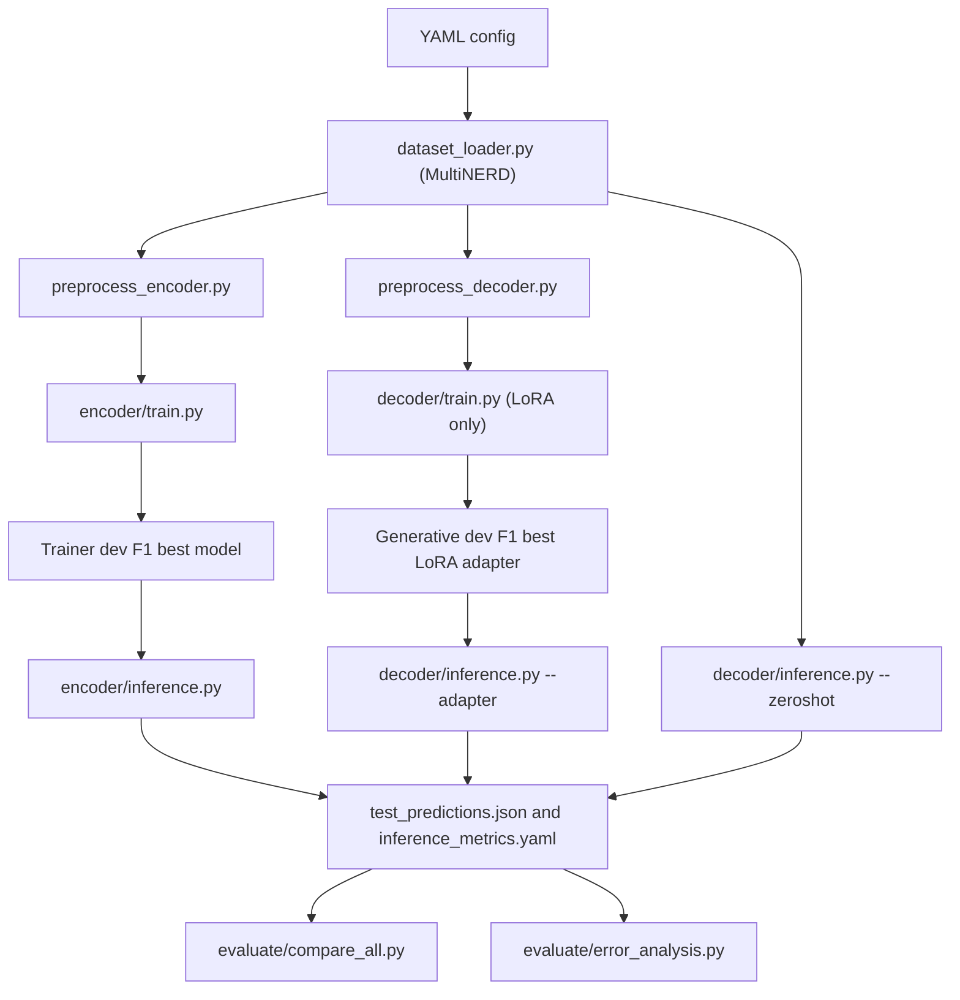

# 1. Project Overview

This repository contains the experimental code for a bachelor thesis project on Named Entity Recognition (NER). NER is the task of finding spans in text that refer to named entities and assigning each span an entity type. For example, a system may label "Berlin" as a location or "Qwen" as a product or organization depending on the dataset taxonomy.

The project compares two different paradigms for solving NER, and the LLM side is further split into two regimes so that the effect of fine-tuning can be isolated:

| Paradigm | Regime | Implementation | Output form |
| --- | --- | --- | --- |
| Encoder token classification | Fine-tuned | DeBERTa with a token classification head | BIO tags, one label per input token |
| Generative LLM | Zero-shot | Qwen3.5 base model, no training, prompt + parser | JSON entity list generated from the prompt |
| Generative LLM | LoRA / QLoRA | Qwen3.5 base model + trained LoRA adapter | JSON entity list generated from the prompt |

The final supported model families are:

| Family | Supported models | Regimes used in the final matrix |
| --- | --- | --- |
| Encoder | `microsoft/deberta-v3-base`, `microsoft/deberta-v3-large` | fine-tuned only |
| LLM / decoder | `Qwen/Qwen3.5-0.8B`, `Qwen/Qwen3.5-4B`, `Qwen/Qwen3.5-27B` | zero-shot **and** LoRA/QLoRA |

The final supported dataset is:

| Dataset | Role | Notes |
| --- | --- | --- |
| `Babelscape/multinerd` | Single active benchmark | English subset only, selected by `lang == "en"`, 15 entity types |

WNUT-17 is no longer part of the active experiment matrix. See Section 15 for what was removed or kept as inactive legacy.

Most commands in this README assume that the working directory is `ba-ner/`:

```bash
cd ba-ner
```

# 2. Research Goal

The research goal is to compare encoder-based NER and LLM-based generative NER under a shared experimental framework on one common benchmark (MultiNERD English).

Encoder models such as DeBERTa treat NER as token-level sequence labeling. The model receives tokenized text and predicts one label per token, usually in BIO format:

```text
Berlin is cold
B-LOC  O  O
```

Generative LLMs treat NER as structured text generation. The model receives an instruction plus an input sentence and generates a JSON list:

```json
[{"entity": "Berlin", "type": "LOC"}]
```

LLMs are evaluated under two regimes:

| Regime | Training | Adapter at inference time | Purpose |
| --- | --- | --- | --- |
| Zero-shot | None | None | Baseline for an untrained LLM with only the prompt |
| LoRA / QLoRA | Parameter-efficient fine-tuning on the MultiNERD train split | Trained LoRA adapter is loaded on top of the base model | Measures how far LoRA/QLoRA closes the gap to a fine-tuned encoder |

The project measures:

| Measurement | Why it matters |
| --- | --- |
| Entity-level precision, recall, and F1 | Core task quality; a span is correct only if boundaries and type match |
| Per-entity-type F1 | Shows which entity categories are easy or difficult |
| Training runtime | Important for experimental cost; zero-shot has no training time |
| Inference latency | Important if the model must be used interactively or at scale |
| VRAM peak | Determines hardware feasibility |
| Trainable and total parameters | Highlights full fine-tuning vs. parameter-efficient LoRA vs. untrained zero-shot |
| Parse failure rate (LLM only) | Measures output robustness of generative structured prediction |

Output robustness and efficiency are central because LLM-based NER is not only a question of F1. A generated answer must also be parseable, use the expected schema and taxonomy, and refer to spans that actually occur in the input text.

# 3. Final Experimental Setup

The final setup contains **8 experiments**, all run on MultiNERD English and all evaluated on the same test split.

## 3.1 Encoder Experiments (Fine-Tuned)

| Config | Hugging Face model | Experiment name | Output directory |
| --- | --- | --- | --- |
| `configs/deberta_base.yaml` | `microsoft/deberta-v3-base` | `deberta-v3-base` | `results/multinerd/deberta-v3-base/` |
| `configs/deberta_large.yaml` | `microsoft/deberta-v3-large` | `deberta-v3-large` | `results/multinerd/deberta-v3-large/` |

## 3.2 LLM Zero-Shot Experiments (No Training)

| Config | Hugging Face model | Experiment name | Output directory |
| --- | --- | --- | --- |
| `configs/qwen35_08b_zeroshot.yaml` | `Qwen/Qwen3.5-0.8B` | `qwen35-08b-zeroshot` | `results/multinerd/qwen35-08b-zeroshot/` |
| `configs/qwen35_4b_zeroshot.yaml`  | `Qwen/Qwen3.5-4B`   | `qwen35-4b-zeroshot`  | `results/multinerd/qwen35-4b-zeroshot/`  |
| `configs/qwen35_27b_zeroshot.yaml` | `Qwen/Qwen3.5-27B`  | `qwen35-27b-zeroshot` | `results/multinerd/qwen35-27b-zeroshot/` |

All three zero-shot configs set `mode: zeroshot`. They have no training hyperparameters and are used exclusively by `src.decoder.inference --zeroshot`.

## 3.3 LLM LoRA/QLoRA Experiments (Fine-Tuned)

| Config | Hugging Face model | Experiment name | Output directory |
| --- | --- | --- | --- |
| `configs/qwen35_08b.yaml` | `Qwen/Qwen3.5-0.8B` | `qwen35-08b-qlora` | `results/multinerd/qwen35-08b-qlora/` |
| `configs/qwen35_4b.yaml`  | `Qwen/Qwen3.5-4B`   | `qwen35-4b-qlora`  | `results/multinerd/qwen35-4b-qlora/`  |
| `configs/qwen35_27b.yaml` | `Qwen/Qwen3.5-27B`  | `qwen35-27b-qlora` | `results/multinerd/qwen35-27b-qlora/` |

All three LoRA configs set `mode: lora`, `use_qlora: true`, `attn_impl: sdpa`, and target the same seven projection modules (`q_proj, k_proj, v_proj, o_proj, gate_proj, up_proj, down_proj`).

## 3.4 Final Matrix

The full comparison matrix that the final pipeline produces:

```text
deberta-v3-base        (encoder,        fine-tuned)
deberta-v3-large       (encoder,        fine-tuned)
qwen35-08b-zeroshot    (LLM,  Qwen3.5-0.8B, zero-shot)
qwen35-4b-zeroshot     (LLM,  Qwen3.5-4B,   zero-shot)
qwen35-27b-zeroshot    (LLM,  Qwen3.5-27B,  zero-shot)
qwen35-08b-qlora       (LLM,  Qwen3.5-0.8B, LoRA/QLoRA)
qwen35-4b-qlora        (LLM,  Qwen3.5-4B,   LoRA/QLoRA)
qwen35-27b-qlora       (LLM,  Qwen3.5-27B,  LoRA/QLoRA)
```

The inclusion of Qwen3.5-0.8B is intentional: at roughly 0.8B parameters, it is close in order of magnitude to `deberta-v3-large` (~435M) and gives the comparison a small-LLM counterpart to the small encoder.

The legacy configs for `bert-base-cased` and `Qwen/Qwen3-14B` are not present and should be considered removed.

# 4. Codebase Architecture

The runnable package is under `ba-ner/`.

```text
ba-ner/
  configs/          YAML experiment configs
  scripts/          Pipeline orchestration and SLURM helper scripts
  src/data/         Dataset loading and preprocessing
  src/encoder/      DeBERTa token-classification training and inference
  src/decoder/      Qwen3.5 training, inference, and output parsing (LoRA + Zero-Shot)
  src/evaluate/     Metrics, efficiency utilities, comparison, and error analysis
  results/          Runtime output directory
  requirements.txt  Python dependency list
  setup.py          Editable package setup
```

The central architectural idea is that MultiNERD is exposed through one dataset abstraction in `src/data/dataset_loader.py`. The encoder and decoder pipelines use the same raw dataset interface but preprocess it differently:

| Pipeline | Preprocessing target |
| --- | --- |
| Encoder | Tokenized features plus aligned BIO labels |
| Decoder (LoRA and zero-shot) | Chat-style messages with a system prompt, user sentence, and JSON assistant answer |

The decoder pipeline uses the **same prompt, same parser, same metrics, and same output layout** for zero-shot and LoRA/QLoRA. The only difference is whether a trained LoRA adapter is loaded on top of the base model.

The current result layout is:

```text
results/<dataset>/<experiment>/
```

Examples:

```text
results/multinerd/deberta-v3-base/
results/multinerd/deberta-v3-large/
results/multinerd/qwen35-08b-zeroshot/
results/multinerd/qwen35-08b-qlora/
results/multinerd/qwen35-4b-zeroshot/
results/multinerd/qwen35-4b-qlora/
results/multinerd/qwen35-27b-zeroshot/
results/multinerd/qwen35-27b-qlora/
```

## Information Flow



The important checkpoint-selection difference is:

| Pipeline | Selection mechanism |
| --- | --- |
| Encoder | Hugging Face `Trainer` selects the best checkpoint by validation F1 with `load_best_model_at_end: true` |
| Decoder / LLM LoRA | A custom generative dev evaluation callback generates entity lists, parses them, computes dev F1, and stores the best adapter in `best_lora_adapter/` |
| Decoder / LLM Zero-Shot | No training, so no selection. The base model is used directly. |

For the decoder, teacher-forced `eval_loss` is not used as the final best-model criterion. The implemented criterion is generated entity-level dev F1.

# 5. Detailed File and Folder Reference

## Repository Root

| Path | Role |
| --- | --- |
| `README.md` | Project documentation |
| `LICENSE` | Project license |
| `.gitignore` | Top-level ignore rules |
| `ba-ner/` | Python project root (training and evaluation commands are run from here) |

## `configs/`

The configs control model identity, dataset choice, hyperparameters, LoRA settings, checkpointing, and output paths. The `mode` field distinguishes the LLM regimes.

| File | Model type | `mode` | Used by |
| --- | --- | --- | --- |
| `configs/deberta_base.yaml` | encoder | — | `src.encoder.train`, `src.encoder.inference` |
| `configs/deberta_large.yaml` | encoder | — | `src.encoder.train`, `src.encoder.inference` |
| `configs/qwen35_08b.yaml`   | decoder | `lora` | `src.decoder.train`, `src.decoder.inference` |
| `configs/qwen35_4b.yaml`    | decoder | `lora` | `src.decoder.train`, `src.decoder.inference` |
| `configs/qwen35_27b.yaml`   | decoder | `lora` | `src.decoder.train`, `src.decoder.inference` |
| `configs/qwen35_08b_zeroshot.yaml` | decoder | `zeroshot` | `src.decoder.inference --zeroshot` only |
| `configs/qwen35_4b_zeroshot.yaml`  | decoder | `zeroshot` | `src.decoder.inference --zeroshot` only |
| `configs/qwen35_27b_zeroshot.yaml` | decoder | `zeroshot` | `src.decoder.inference --zeroshot` only |

Zero-shot configs intentionally omit training hyperparameters. Trying to call `src.decoder.train` on a zero-shot config is not part of the workflow — use the LoRA configs for training.

## `src/data/`

| File | Role |
| --- | --- |
| `src/data/dataset_loader.py` | Central dataset entry point. Returns `(DatasetDict, DatasetInfo)` with `tokens`, `ner_tags`, label mappings, entity types, and label counts. |
| `src/data/preprocess_encoder.py` | Tokenizes pre-split words and aligns BIO labels to subword tokens. |
| `src/data/preprocess_decoder.py` | Converts BIO labels into entity dictionaries and builds chat-style messages for SFT and for inference prompts (shared by LoRA and zero-shot). |
| `src/data/load_wnut17.py` | Legacy WNUT-17 inspection helper. Not part of the active pipeline. |

`dataset_loader.py` still recognises `wnut_17` internally, because `get_dataset_info("wnut_17")` is needed by legacy code paths and by `error_analysis.py --dataset wnut_17`. It is kept as inactive legacy — no active config requests WNUT-17.

## `src/encoder/`

| File | Role |
| --- | --- |
| `src/encoder/train.py` | Trains a DeBERTa token classifier; writes `regime: encoder` into `results.yaml`. |
| `src/encoder/inference.py` | Runs test-set inference for a saved encoder; writes `regime: encoder` into `inference_metrics.yaml`. |

## `src/decoder/`

| File | Role |
| --- | --- |
| `src/decoder/train.py` | LoRA/QLoRA fine-tuning via TRL `SFTTrainer`; writes `regime: llm_lora` into `results.yaml`. |
| `src/decoder/inference.py` | Supports both LoRA (`--adapter`) and zero-shot (`--zeroshot`) on the same code path. Writes `regime: llm_lora` or `regime: llm_zeroshot` into `inference_metrics.yaml`. |
| `src/decoder/parse_output.py` | Parses generated LLM output and converts entity lists to BIO tags. |

The decoder path is deliberately shared across regimes: the prompt is built from the dataset's entity types by `preprocess_decoder.build_system_prompt()`, parsing goes through `parse_llm_output()`, and evaluation uses `evaluate_llm_predictions()`. The only regime-specific branch in `inference.py` is whether a `PeftModel` wraps the base model or not.

## `src/evaluate/`

| File | Role |
| --- | --- |
| `src/evaluate/metrics.py` | Shared seqeval-based NER metrics. |
| `src/evaluate/efficiency.py` | Parameter counts, VRAM peak, latency helpers. |
| `src/evaluate/error_analysis.py` | Qualitative error categorization; `--dataset {multinerd,wnut_17}` controls the valid-type set. |
| `src/evaluate/compare_all.py` | Aggregates results and produces the terminal table, the F1 bar plot, the per-entity heatmap, and the LaTeX table. Regime-aware: distinguishes encoder / LLM Zero-Shot / LLM LoRA. |

`compare_all.py` derives the regime for each experiment in this order:
1. The explicit `regime` field written by `train.py` / `inference.py`.
2. A heuristic on `experiment_name` (`*-zeroshot` → `llm_zeroshot`, `*-qlora` / `*-lora` → `llm_lora`).
3. The `model_type` field as a fallback (`encoder` → `encoder`, else `llm_lora`).

This keeps old result files readable and still routes new results through the explicit field.

## `scripts/`

| File | Role |
| --- | --- |
| `scripts/run_all.py` | Python orchestrator. Runs any subset of the 8-experiment matrix. Knows three groups: encoders, LLM LoRA, LLM zero-shot. |
| `scripts/run_encoder.sh` | SLURM/local helper: trains and evaluates the two DeBERTa encoders on MultiNERD. |
| `scripts/run_decoder.sh` | SLURM/local helper: runs the six LLM experiments on MultiNERD (3 zero-shot inferences + 3 LoRA trainings with inference). |

## `results/`

`results/` is the runtime output tree. It is mostly empty in a fresh checkout. Training and inference create subdirectories under `results/multinerd/<experiment>/`.

## Package and Dependency Files

| File | Role |
| --- | --- |
| `setup.py` | Minimal editable package setup. Python `>=3.10`. |
| `requirements.txt` | Runtime dependency list (Torch, Transformers, Datasets, Accelerate, PEFT, TRL, bitsandbytes, seqeval, scikit-learn, Rich, Matplotlib, PyYAML, pandas, NumPy). |
| `ba-ner/.gitignore` | Project-specific ignore rules. |

# 6. Dataset Handling

The central data loader is `src/data/dataset_loader.py`. It defines a `DatasetInfo` dataclass with:

| Field | Meaning |
| --- | --- |
| `name` | Short dataset name (`multinerd`) |
| `hf_name` | Hugging Face dataset identifier (`Babelscape/multinerd`) |
| `label_list` | Ordered BIO label list |
| `id2label`, `label2id` | Integer↔label mappings |
| `entity_types` | Entity types without the `B-` / `I-` prefix |
| `num_labels` | Number of labels for the encoder classification head |

For MultiNERD, the loader calls `load_dataset("Babelscape/multinerd")`, filters `x["lang"] == language` (default `en`), and removes the `lang` column. The remaining splits contain `tokens` and `ner_tags`.

The MultiNERD taxonomy used in this project contains 15 entity types, giving 31 BIO labels including `O`:

```text
PER, ORG, LOC, ANIM, BIO, CEL, DIS, EVE, FOOD, INST, MEDIA, MYTH, PLANT, TIME, VEHI
```

For encoders, subword alignment uses the first subword of each word only. Special tokens and later subwords receive label ID `-100`, which PyTorch and seqeval-style filtering ignore.

For decoders (both regimes), the system prompt is built dynamically from `DatasetInfo.entity_types` in `preprocess_decoder.build_system_prompt()`, so zero-shot and LoRA always see a prompt aligned with the active taxonomy.

# 7. Encoder Pipeline

The encoder pipeline is implemented in `src/encoder/train.py` and `src/encoder/inference.py`.

## Training

```bash
python -m src.encoder.train configs/deberta_base.yaml
```

The flow is: load config → seed everything → preprocess MultiNERD → load `AutoModelForTokenClassification` with dataset-specific `num_labels` → run `Trainer` → load best checkpoint by val F1 → save `best_model/` → evaluate on test → write `results.yaml`.

Active encoder configs set:

```yaml
load_best_model_at_end: true
metric_for_best_model: f1
greater_is_better: true
```

Although the encoder configs contain `fp16: true`, the code picks bf16 on CUDA devices that support it and otherwise falls back to fp16.

## Inference

```bash
python -m src.encoder.inference \
  --model results/multinerd/deberta-v3-base/best_model \
  --config configs/deberta_base.yaml
```

Inference reloads the saved model and tokenizer, preprocesses the test split in the same way as training, and writes:

```text
results/multinerd/<experiment>/test_predictions.json
results/multinerd/<experiment>/inference_metrics.yaml
```

The encoder `test_predictions.json` schema is:

```json
[
  {
    "tokens": ["..."],
    "gold": ["O", "B-LOC"],
    "pred": ["O", "B-LOC"]
  }
]
```

# 8. Decoder / LLM Pipeline

The decoder pipeline is implemented in `src/decoder/train.py`, `src/decoder/inference.py`, and `src/decoder/parse_output.py`. The training script is only relevant for LoRA/QLoRA; zero-shot skips training entirely.

## Shared Training Format

NER is reformulated as chat-style structured generation. Each training sample becomes a `messages` list:

```json
[
  {"role": "system",    "content": "You are a Named Entity Recognition (NER) system..."},
  {"role": "user",      "content": "input sentence"},
  {"role": "assistant", "content": "[{\"entity\": \"Berlin\", \"type\": \"LOC\"}]"}
]
```

The system prompt is generated from the active dataset's entity types. The assistant answer is created by converting the gold BIO sequence into entity dictionaries. The same prompt structure is reused for zero-shot inference.

## LoRA / QLoRA Configuration

All three active LoRA configs (`qwen35_08b.yaml`, `qwen35_4b.yaml`, `qwen35_27b.yaml`) set:

```yaml
use_qlora: true
attn_impl: sdpa
```

When `use_qlora` is true, the base model is loaded with a `BitsAndBytesConfig` using 4-bit NF4 quantization, double quantization, and bfloat16 compute dtype.

LoRA target modules:

```text
q_proj, k_proj, v_proj, o_proj, gate_proj, up_proj, down_proj
```

| Config | `lora_r` | `lora_alpha` | Per-device batch | Grad acc | Epochs | LR |
| --- | --- | --- | --- | --- | --- | --- |
| `qwen35_08b.yaml` | 16 | 32 | 8 | 2  | 3 | 3e-4 |
| `qwen35_4b.yaml`  | 16 | 32 | 4 | 4  | 3 | 2e-4 |
| `qwen35_27b.yaml` | 32 | 64 | 1 | 16 | 2 | 1e-4 |

The decoder training config uses TRL `SFTTrainer` with `load_best_model_at_end: false`. Best-model selection is handled by `GenerativeDevEvalCallback`, which runs `model.generate()` on up to `gen_eval_max_samples` validation prompts, parses the output, computes generated-entity F1, and saves the current LoRA adapter to `best_lora_adapter/` whenever that metric improves. The final (last-epoch) adapter is saved separately to `lora_adapter/`.

## Zero-Shot Configuration

The three zero-shot configs (`qwen35_08b_zeroshot.yaml`, `qwen35_4b_zeroshot.yaml`, `qwen35_27b_zeroshot.yaml`) set:

```yaml
mode: zeroshot
use_qlora: true
attn_impl: sdpa
max_new_tokens: 256
```

They contain no training hyperparameters. `src.decoder.inference` detects the zero-shot mode from either the CLI flag `--zeroshot` or the config field `mode: zeroshot` (the CLI flag wins). When zero-shot is active:

- The tokenizer is loaded from the base model, not from an adapter directory.
- No `PeftModel` is wrapped around the base model.
- `regime: llm_zeroshot` is written into `inference_metrics.yaml`.
- The output directory is `results/multinerd/<experiment>/` where `<experiment>` ends in `-zeroshot`.

If neither `--adapter` nor `--zeroshot` is provided, `run_decoder_inference()` raises a `ValueError`.

## Parser Behavior

`src/decoder/parse_output.py` expects output like:

```json
[{"entity": "Barack Obama", "type": "PER"}]
```

It applies these parsing strategies:

| Status | Meaning |
| --- | --- |
| `ok` | Direct JSON parsing succeeded |
| `markdown_stripped` | JSON was parsed after removing a Markdown code fence |
| `regex_fallback` | JSON array was parsed after extracting the first bracketed array |
| `failed` | No valid JSON list could be parsed |

Before parsing, the parser strips `<think>...</think>` blocks. It validates entity dictionaries and filters unknown entity types against the active `DatasetInfo.entity_types` set.

The conversion from entity dictionaries back to BIO tags uses exact whitespace token matching. This is simple and transparent, but it means generated spans with different casing or punctuation spacing may fail to align to the original token list.

## Decoder Inference

LoRA/QLoRA:

```bash
python -m src.decoder.inference \
  --adapter results/multinerd/qwen35-4b-qlora/best_lora_adapter \
  --base Qwen/Qwen3.5-4B \
  --config configs/qwen35_4b.yaml
```

Zero-shot:

```bash
python -m src.decoder.inference \
  --zeroshot \
  --base Qwen/Qwen3.5-4B \
  --config configs/qwen35_4b_zeroshot.yaml
```

Both calls produce:

```text
results/multinerd/<experiment>/test_predictions.json
results/multinerd/<experiment>/inference_metrics.yaml
```

The decoder `test_predictions.json` schema is shared:

```json
[
  {
    "tokens": ["..."],
    "gold_entities": [{"entity": "...", "type": "..."}],
    "pred_entities": [{"entity": "...", "type": "..."}],
    "raw_output": "[...]",
    "parse_status": "ok",
    "gold_bio": ["O", "B-LOC"],
    "pred_bio": ["O", "B-LOC"]
  }
]
```

# 9. Configuration System

Each experiment is controlled by one YAML file in `configs/`.

## Common Fields

| Field | Used by | Meaning |
| --- | --- | --- |
| `experiment_name` | All | Directory name inside `results/<dataset>/` |
| `model_name` | All | Hugging Face model ID |
| `model_type` | All | `encoder` or `decoder` |
| `mode` | Decoder only | `lora` or `zeroshot` |
| `dataset` | All | Currently `multinerd` in all active configs |
| `dataset_language` | Dataset loader | Language filter for MultiNERD, default `en` |
| `seed` | Training / inference | Random seed |
| `output_dir` | Training / inference | Default output path |
| `use_wandb` | Training | Whether to report to W&B |

## Encoder Fields

`max_length`, `learning_rate`, `num_train_epochs`, `per_device_train_batch_size`, `per_device_eval_batch_size`, `gradient_accumulation_steps`, `weight_decay`, `warmup_ratio`, `lr_scheduler_type`, `eval_strategy`, `save_strategy`, `save_total_limit`, `load_best_model_at_end`, `metric_for_best_model`, `greater_is_better`, `early_stopping_patience`.

## Decoder LoRA Fields

`use_qlora`, `attn_impl`, `lora_r`, `lora_alpha`, `lora_dropout`, `target_modules`, `max_seq_length`, `packing`, `gradient_checkpointing`, `gen_eval_max_samples`, plus the standard training hyperparameters.

## Decoder Zero-Shot Fields

Only `use_qlora`, `attn_impl`, `max_new_tokens`, `seed`, and I/O fields. No LoRA and no training hyperparameters.

# 10. How to Run the Final Experiments

These commands are documentation examples and are not run automatically.

## Environment Setup

```bash
cd ba-ner
python -m venv .venv
source .venv/bin/activate
pip install -e .
pip install -r requirements.txt
```

The project requires Python `>=3.10`. On a cluster, the shell scripts assume a conda environment named `ba-ner`:

```bash
source activate ba-ner
```

## Run Encoder Training + Inference

```bash
python -m src.encoder.train configs/deberta_base.yaml
python -m src.encoder.train configs/deberta_large.yaml

python -m src.encoder.inference \
  --model results/multinerd/deberta-v3-base/best_model \
  --config configs/deberta_base.yaml

python -m src.encoder.inference \
  --model results/multinerd/deberta-v3-large/best_model \
  --config configs/deberta_large.yaml
```

## Run LLM Zero-Shot Inference (No Training)

```bash
python -m src.decoder.inference \
  --zeroshot \
  --base Qwen/Qwen3.5-0.8B \
  --config configs/qwen35_08b_zeroshot.yaml

python -m src.decoder.inference \
  --zeroshot \
  --base Qwen/Qwen3.5-4B \
  --config configs/qwen35_4b_zeroshot.yaml

python -m src.decoder.inference \
  --zeroshot \
  --base Qwen/Qwen3.5-27B \
  --config configs/qwen35_27b_zeroshot.yaml
```

## Run LLM LoRA Training + Inference

```bash
python -m src.decoder.train configs/qwen35_08b.yaml
python -m src.decoder.inference \
  --adapter results/multinerd/qwen35-08b-qlora/best_lora_adapter \
  --base Qwen/Qwen3.5-0.8B \
  --config configs/qwen35_08b.yaml

python -m src.decoder.train configs/qwen35_4b.yaml
python -m src.decoder.inference \
  --adapter results/multinerd/qwen35-4b-qlora/best_lora_adapter \
  --base Qwen/Qwen3.5-4B \
  --config configs/qwen35_4b.yaml

python -m src.decoder.train configs/qwen35_27b.yaml
python -m src.decoder.inference \
  --adapter results/multinerd/qwen35-27b-qlora/best_lora_adapter \
  --base Qwen/Qwen3.5-27B \
  --config configs/qwen35_27b.yaml
```

## Run the Full Pipeline

Full 8-experiment matrix:

```bash
python scripts/run_all.py
```

Only encoder experiments:

```bash
python scripts/run_all.py --encoder-only
```

Only LLM experiments (both regimes):

```bash
python scripts/run_all.py --decoder-only
```

Only LLM zero-shot (all three sizes):

```bash
python scripts/run_all.py --zeroshot-only
```

Only fine-tuned models (both DeBERTa + all three LoRA LLMs):

```bash
python scripts/run_all.py --finetuned-only
```

Only comparison, assuming result files already exist:

```bash
python scripts/run_all.py --eval-only
```

One model at a time (CLI short names):

```bash
python scripts/run_all.py --model deberta_base
python scripts/run_all.py --model deberta_large
python scripts/run_all.py --model qwen35_08b
python scripts/run_all.py --model qwen35_4b
python scripts/run_all.py --model qwen35_27b
python scripts/run_all.py --model qwen35_08b_zs
python scripts/run_all.py --model qwen35_4b_zs
python scripts/run_all.py --model qwen35_27b_zs
```

Skip training or inference steps:

```bash
python scripts/run_all.py --skip-train
python scripts/run_all.py --skip-inference
```

## SLURM Usage

```bash
sbatch scripts/run_encoder.sh
sbatch scripts/run_decoder.sh
```

The decoder SLURM script runs all six LLM experiments (3 zero-shot + 3 LoRA training+inference) sequentially. It requests one A100 GPU and 24 hours. Adjust the SBATCH header for your cluster if needed.

Logs are written to:

```text
logs/encoder_<jobid>.log
logs/encoder_<jobid>.err
logs/decoder_<jobid>.log
logs/decoder_<jobid>.err
```

## Run Comparison

```bash
python -m src.evaluate.compare_all
python -m src.evaluate.compare_all --dataset multinerd
python -m src.evaluate.compare_all --results-dir results
```

`compare_all.py` writes the terminal table, `results/comparison_f1.pdf`, `results/per_entity_heatmap_multinerd.pdf`, and `results/comparison_table.tex`. All artifacts distinguish the three regimes (Encoder / LLM Zero-Shot / LLM LoRA).

## Run Error Analysis

```bash
python -m src.evaluate.error_analysis \
  --encoder-preds results/multinerd/deberta-v3-large/test_predictions.json \
  --decoder-preds results/multinerd/qwen35-27b-qlora/test_predictions.json \
  --dataset multinerd
```

The current CLI prints a summary table and does not write an error-analysis file by default.

# 11. Output Structure and How to Interpret Results

All current experiment artifacts use:

```text
results/multinerd/<experiment>/
```

## Encoder Artifacts

```text
results/multinerd/<deberta-experiment>/
  checkpoint-*/
  best_model/
  results.yaml
  test_predictions.json
  inference_metrics.yaml
```

Encoder `results.yaml` includes `regime: encoder` plus the standard training summary fields (`experiment_name`, `model_name`, `model_type: encoder`, `dataset`, `test_f1`, `test_precision`, `test_recall`, `train_runtime_seconds`, `best_model_dir`, `seed`, `num_train_epochs`, `learning_rate`, `per_device_train_batch_size`, `max_length`).

## Decoder LoRA Artifacts

```text
results/multinerd/<qwen-experiment>-qlora/
  checkpoint-*/
  best_lora_adapter/
  lora_adapter/
  results.yaml
  test_predictions.json
  inference_metrics.yaml
```

`results.yaml` includes `regime: llm_lora`, `use_qlora`, LoRA rank/alpha, `train_runtime_seconds`, `trainable_params`, `total_params`, `best_dev_f1`, `best_epoch`, `epoch_results`, `best_adapter_dir`, `last_adapter_dir`.

## Decoder Zero-Shot Artifacts

```text
results/multinerd/<qwen-experiment>-zeroshot/
  test_predictions.json
  inference_metrics.yaml
```

Zero-shot experiments have no training checkpoints and no adapter directories. `inference_metrics.yaml` includes `regime: llm_zeroshot` and is otherwise shaped identically to the LoRA case (same `test_f1`, `test_precision`, `test_recall`, `latency_*`, `vram_peak_mb`, `total_params`, plus parser fields).

## Metrics Files

`inference_metrics.yaml` is the main file for final test-set comparison. For encoders it contains:

```text
regime: encoder
test_f1
test_precision
test_recall
latency_ms_mean
latency_ms_p95
vram_peak_mb
total_params
```

For decoders (both regimes) it additionally contains parser stats:

```text
regime: llm_lora | llm_zeroshot
parse_failure_rate
parse_ok
parse_markdown_stripped
parse_regex_fallback
parse_failed
```

## Comparison Artifacts

`src.evaluate.compare_all` writes:

| Artifact | Meaning |
| --- | --- |
| `results/comparison_f1.pdf` | Horizontal bar plot of entity-level F1 scores, coloured per regime (Encoder / LLM Zero-Shot / LLM LoRA) |
| `results/per_entity_heatmap_multinerd.pdf` | Per-entity-type F1 heatmap for MultiNERD |
| `results/comparison_table.tex` | LaTeX table with columns `Model`, `Regime`, `Params`, `F1`, `Precision`, `Recall` |
| Terminal Rich table | Human-readable sorted comparison table with a `Regime` column |

Zero-shot rows show `-` in the `Train (min)` column because they have no training time.

# 12. Typical End-to-End Workflow

A practical workflow for the main benchmark:

1. Choose a config.
2. Train (or skip training for zero-shot).
3. Run inference.
4. Inspect `inference_metrics.yaml`.
5. Compare all experiments.
6. Inspect errors.

For a single-model run through the orchestrator, use e.g.:

```bash
python scripts/run_all.py --model qwen35_08b
python scripts/run_all.py --model qwen35_08b_zs
```

For the complete comparison:

```bash
python scripts/run_all.py
```

# 13. Technical Notes and Caveats

| Caveat | Explanation |
| --- | --- |
| Qwen model IDs may need upstream verification | Active configs use `Qwen/Qwen3.5-0.8B`, `Qwen/Qwen3.5-4B`, and `Qwen/Qwen3.5-27B`. If model loading fails with a Hugging Face "not found" error, verify the current upstream IDs and access requirements. |
| Qwen3.5-27B is resource-heavy | Even in 4-bit QLoRA, the 27B model needs roughly 24 GB VRAM; this applies to both zero-shot and LoRA inference. |
| Generative dev evaluation costs extra time | LoRA training runs `model.generate()` on up to `gen_eval_max_samples` validation samples after each evaluation event. This is slower than teacher-forced `eval_loss` but better matches final inference behavior. |
| `load_best_model_at_end=False` is intentional for decoder training | The decoder best adapter is selected by generated dev F1 in `GenerativeDevEvalCallback`, not by Trainer loss. |
| Active Qwen configs use SDPA | Qwen3.5 is trained and evaluated with `attn_impl: sdpa`, not `flash_attention_2`. |
| Encoder precision is hardware-dependent | Encoder training prefers bf16 on CUDA devices that support it, otherwise fp16. |
| Decoder training uses bf16 | TRL `SFTConfig` sets `bf16=True`, `fp16=False`. GPU-oriented. |
| MultiNERD filtering is simple | The loader filters `lang == "en"` and removes the `lang` column. No extra balancing or custom split logic. |
| Zero-shot configs cannot be trained | `src.decoder.train` is only designed for LoRA configs. The zero-shot configs intentionally omit training fields. |
| Decoder span matching is exact | `entities_to_bio()` matches generated entity text against whitespace-split tokens. Formatting differences can reduce measured F1 even when the generated text is semantically close. |
| WNUT-17 is legacy, not active | `dataset_loader.py` still recognises `wnut_17` so that older result directories and the `error_analysis.py --dataset wnut_17` path remain usable, but no active config, script, or orchestrator option points to it. |

# 14. Minimal Command Reference

From repository root:

```bash
cd ba-ner
```

Install:

```bash
python -m venv .venv
source .venv/bin/activate
pip install -e .
pip install -r requirements.txt
```

Train encoders on MultiNERD:

```bash
python -m src.encoder.train configs/deberta_base.yaml
python -m src.encoder.train configs/deberta_large.yaml
```

Train LoRA LLMs on MultiNERD:

```bash
python -m src.decoder.train configs/qwen35_08b.yaml
python -m src.decoder.train configs/qwen35_4b.yaml
python -m src.decoder.train configs/qwen35_27b.yaml
```

Run LLM zero-shot (no training):

```bash
python -m src.decoder.inference --zeroshot --base Qwen/Qwen3.5-0.8B --config configs/qwen35_08b_zeroshot.yaml
python -m src.decoder.inference --zeroshot --base Qwen/Qwen3.5-4B   --config configs/qwen35_4b_zeroshot.yaml
python -m src.decoder.inference --zeroshot --base Qwen/Qwen3.5-27B  --config configs/qwen35_27b_zeroshot.yaml
```

Run full MultiNERD pipeline (all 8 experiments + comparison):

```bash
python scripts/run_all.py
```

Run comparison only:

```bash
python -m src.evaluate.compare_all --dataset multinerd
```

Submit SLURM scripts:

```bash
sbatch scripts/run_encoder.sh
sbatch scripts/run_decoder.sh
```

# 15. What Was Removed or Deprecated

| Item | Status | Details |
| --- | --- | --- |
| `configs/bert_base.yaml` | Removed | Not present in the config directory. |
| `configs/qwen3_14b.yaml` | Removed | Replaced by the `Qwen/Qwen3.5-*` family. |
| WNUT-17 active benchmark | Removed from the active matrix | No active config uses `dataset: wnut_17`. `scripts/run_all.py` has no `--wnut17` flag. `scripts/run_encoder.sh` and `scripts/run_decoder.sh` no longer mention WNUT. |
| WNUT-17 dataset loader code | Kept as inactive legacy | `dataset_loader.py` and `load_wnut17.py` still know about `wnut_17` so that legacy result directories and `error_analysis.py --dataset wnut_17` stay functional. They are not referenced by any active experiment. |
| Zero-shot encoders | Never implemented | Encoder models are always fine-tuned. Only LLMs have a zero-shot regime in this project. |

# 16. Troubleshooting

## `ModuleNotFoundError: No module named 'src'`

Run commands from `ba-ner/` and install the editable package:

```bash
cd ba-ner
pip install -e .
```

## Wrong Config Path

If you see a file-not-found error for `configs/...`, check that your working directory is `ba-ner/` and that the config is one of:

```text
configs/deberta_base.yaml
configs/deberta_large.yaml
configs/qwen35_08b.yaml
configs/qwen35_4b.yaml
configs/qwen35_27b.yaml
configs/qwen35_08b_zeroshot.yaml
configs/qwen35_4b_zeroshot.yaml
configs/qwen35_27b_zeroshot.yaml
```

## Missing Dependencies

```bash
pip install -e .
pip install -r requirements.txt
```

If `flash-attn` fails to install, note that the active Qwen configs use `attn_impl: sdpa` and do not request FlashAttention.

## Model Loading Issues

| Symptom | Likely cause |
| --- | --- |
| Model-not-found / 404 | Verify the upstream Hugging Face model ID still matches the config |
| Access denied | Check whether the model requires authentication or license acceptance |
| CUDA out of memory | Use a smaller Qwen size (0.8B, 4B), reduce batch size, or move to a larger GPU |
| bitsandbytes error | Check CUDA, PyTorch, and bitsandbytes compatibility |

## Zero-Shot vs. LoRA Mix-Ups

`src.decoder.inference` requires either `--adapter <path>` **or** `--zeroshot`. If neither is provided, it raises `ValueError`. If you mistakenly point `--adapter` at a LoRA config while using a zero-shot experiment name, the output directory will be wrong — use the matching zero-shot config file in that case.

## Parser Issues in Decoder Outputs

Check `test_predictions.json`:

```text
raw_output
parse_status
pred_entities
pred_bio
```

High parse failure rates for LoRA runs usually indicate generation truncation, a wrong adapter, or that the model is not following the prompt format. For zero-shot runs, high parse failures are expected behavior — they are one of the main findings the experiment is designed to measure.

## Hardware and VRAM Issues

| Model | Practical note |
| --- | --- |
| `Qwen/Qwen3.5-0.8B` | Smallest LLM; fits on small GPUs even without QLoRA |
| `Qwen/Qwen3.5-4B` | Mid-sized; QLoRA is enabled by default |
| `Qwen/Qwen3.5-27B` | Much larger; ~24 GB VRAM minimum with 4-bit quantization |

If CUDA runs out of memory, use a smaller model, reduce batch size, increase gradient accumulation, or run on a larger GPU.

## Missing Result Folders

Inference expects training artifacts for LoRA:

```text
Encoder:  results/multinerd/<experiment>/best_model/
LLM LoRA: results/multinerd/<experiment>/best_lora_adapter/
```

Zero-shot runs need nothing from a previous training step, so `--skip-train` is safe for them.

## Confusion About Dev-Best vs. Final Test Evaluation

For encoders: dev best = Trainer validation F1; test metrics = computed after training and again by `src.encoder.inference`.

For LoRA LLMs: dev best = generative validation F1 saved to `best_lora_adapter/`; test metrics = computed only by `src.decoder.inference`.

For zero-shot LLMs: no dev selection happens. Test metrics are what `src.decoder.inference --zeroshot` reports.

Do not interpret decoder `eval_loss` as the final model-selection criterion.
