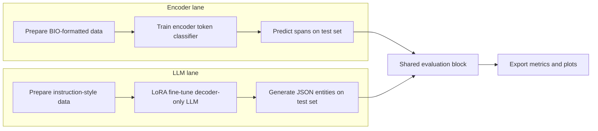

# LLM vs Encoder for Named Entity Recognition

    

## Abstract

In this thesis repository, I compare two NER paradigms on biomedical text: encoder-based token classification and decoder-only LLM extraction with LoRA fine-tuning. I run both approaches on aligned train/validation/test splits and evaluate them with one shared span-level protocol. The comparison emphasizes strict extraction correctness rather than approximate token overlap. I also track LLM output robustness through JSON and span-validity checks to make failure modes explicit.

## Research Question

Can a LoRA-tuned decoder-only LLM match encoder-based BIO NER performance under strict span-level evaluation for biomedical entity extraction?

## Methods Summary

- I train an encoder-based token classifier using BIO tagging.
- I fine-tune a decoder-only LLM with PEFT LoRA for entity extraction.
- I enforce structured JSON extraction and map outputs to span annotations for shared evaluation.

## Datasets

I use biomedical NER data focused on disease and chemical entities.  
I convert all splits to one canonical internal format:

```json
{ "id": "sample_id", "text": "raw text", "entities": [{ "start": 0, "end": 10, "label": "DISEASE" }] }
```

Character offsets are the source of truth across preprocessing, training, and evaluation.

## Evaluation

### Primary Metric

- Strict span-level micro Precision / Recall / F1
- A prediction is correct only with exact `start`, `end`, and `label` match

### LLM-Specific Robustness Metrics

- JSON validity rate
- Parse failure rate
- Overlapping spans
- Out-of-bound spans

## Experimental Flow



## Project Structure

```text
llm-vs-encoder-ner/
│
├── data/
│   ├── train.json
│   ├── validation.json
│   └── test.json
│
├── scripts/
│   ├── 01_train_encoder.py
│   ├── 02_eval_encoder.py
│   ├── 10_train_llm_lora.py
│   ├── 11_eval_llm.py
│   └── 20_make_plots.py
│
├── runs/
│   ├── encoder_model/
│   └── llm_lora_model/
│
├── results/
│   ├── metrics_encoder.json
│   ├── metrics_llm.json
│   └── plots/
│
└── README.md
```

## Installation

```bash
pip install -r requirements.txt
```

Optional Conda environment:

```bash
conda create -n llm-vs-encoder-ner python=3.11 -y
conda activate llm-vs-encoder-ner
pip install -r requirements.txt
```

## Running Experiments

```bash
python scripts/01_train_encoder.py
python scripts/02_eval_encoder.py
python scripts/10_train_llm_lora.py
python scripts/11_eval_llm.py
python scripts/20_make_plots.py
```

## Hardware

I run experiments on a CUDA-capable GPU. Encoder training is moderate in memory usage, while decoder-only LLM fine-tuning requires more VRAM; LoRA is used to reduce memory and make LLM adaptation feasible on limited hardware.

## Reproducibility Checklist

- Fixed random seeds
- Explicit train/validation/test splits
- Logged hyperparameters for all runs
- Deterministic evaluation pipeline
- Shared span-level evaluation across encoder and LLM outputs

## Author

Luaj Osman  
Bachelor Thesis – Transformer Model Comparison Study

## License

This repository is released for academic use (research and thesis reproduction).
