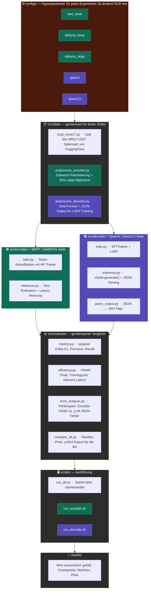

# Vergleich von Encoder-basierten Modellen und LLMs mit LoRA für Named Entity Recognition

**Bachelorarbeit · B.Sc. Wirtschaftsinformatik · TU Berlin / DFKI**

Dieses Projekt vergleicht zwei fundamentale Paradigmen für Named Entity Recognition (NER) auf dem WNUT-2017 Datensatz: Encoder-basierte Transformer (BERT, DeBERTa) als Token-Klassifikatoren mit BIO-Tagging und Large Language Models (Qwen3, Qwen3.5) als generative Systeme mit LoRA-Finetuning und strukturiertem JSON-Output. Beide Ansätze werden unter identischen experimentellen Bedingungen auf Modellgüte (Precision, Recall, F1), Trainingsaufwand, VRAM-Bedarf sowie Inferenzgeschwindigkeit evaluiert. Ein besonderer Fokus liegt auf der Output-Robustheit generativer Modelle und dem Einfluss von Parameter-Efficient Fine-Tuning (LoRA/QLoRA).

---

## 📐 Pipeline-Architektur



---

## 🔬 Modelle

| Modell | Typ | Parameter | Methode | GPU-Bedarf |
|--------|-----|----------:|---------|------------|
| `bert-base-cased` | Encoder | 110M | Full Fine-Tuning | 1× GPU (beliebig) |
| `microsoft/deberta-v3-base` | Encoder | 86M | Full Fine-Tuning | 1× GPU (beliebig) |
| `microsoft/deberta-v3-large` | Encoder | 304M | Full Fine-Tuning | 1× GPU 16GB+ |
| `Qwen/Qwen3-14B` | Decoder | 14B | QLoRA (4-bit) | 1× GPU 24GB+ |
| `Qwen/Qwen3.5-27B` | Decoder | 27B | bf16 LoRA | 1× A100 80GB |

---

## 📦 Datensatz: WNUT-2017

| Eigenschaft | Wert |
|-------------|------|
| Quelle | ACL Workshop on Noisy User-generated Text 2017 |
| Domäne | Social-Media-Text (Twitter, Reddit, YouTube) |
| Entity-Typen | `person`, `location`, `corporation`, `creative-work`, `group`, `product` |
| Train | ~3.394 Sätze |
| Validation | ~842 Sätze |
| Test | ~1.287 Sätze |
| HuggingFace | `datasets.load_dataset("wnut_17")` |

WNUT-2017 ist bewusst schwieriger als CoNLL-2003: Noisy Text, unorthodoxe Schreibweisen und seltene *Emerging Entities* (neue Produkte, Personen, Gruppen) stellen besondere Anforderungen an die Generalisierungsfähigkeit der Modelle.

---

## 🚀 Schnellstart

```bash
# 1. Environment erstellen
python -m venv .venv
source .venv/bin/activate   # Windows: .venv\Scripts\activate

# 2. Paket + Dependencies installieren
pip install -e .
pip install -r requirements.txt

# 3. Datensatz laden und Statistiken anzeigen
python -m src.data.load_wnut17

# 4. Schnelltest: BERT trainieren (kleinster Encoder)
python -m src.encoder.train configs/bert_base.yaml

# 5. Decoder trainieren (A100 empfohlen)
python -m src.decoder.train configs/qwen35_27b.yaml

# 6. Gesamte Pipeline (alle 5 Modelle)
python scripts/run_all.py
```

---

## ⚙️ Verwendung im Detail

### Encoder trainieren

```bash
python -m src.encoder.train configs/deberta_large.yaml   # Hauptmodell
python -m src.encoder.train configs/deberta_base.yaml
python -m src.encoder.train configs/bert_base.yaml
```

Checkpoints und das beste Modell werden unter `results/<experiment_name>/best_model/` gespeichert. Early Stopping (Patience 3) verhindert Overfitting.

### Decoder trainieren

```bash
python -m src.decoder.train configs/qwen35_27b.yaml   # bf16 LoRA, A100
python -m src.decoder.train configs/qwen3_14b.yaml    # 4-bit QLoRA
```

LoRA-Adapter werden unter `results/<experiment_name>/lora_adapter/` gespeichert.

### Inferenz und Evaluation

```bash
# Encoder
python -m src.encoder.inference \
    --model results/deberta-v3-large/best_model \
    --config configs/deberta_large.yaml

# Decoder
python -m src.decoder.inference \
    --adapter results/qwen35-27b-lora/lora_adapter \
    --base Qwen/Qwen3.5-27B \
    --config configs/qwen35_27b.yaml
```

Beide Befehle speichern `test_predictions.json` und `inference_metrics.yaml` im jeweiligen Ergebnisordner.

### Vergleich und Plots generieren

```bash
python -m src.evaluate.compare_all
# Ausgabe: results/comparison_f1.pdf, per_entity_heatmap.pdf, comparison_table.tex
```

### Fehleranalyse

```bash
python -m src.evaluate.error_analysis \
    --encoder-preds results/deberta-v3-large/test_predictions.json \
    --decoder-preds results/qwen35-27b-lora/test_predictions.json
```

### Auf dem Uni-Cluster (SLURM)

```bash
sbatch scripts/run_encoder.sh   # ~2h, 1× GPU
sbatch scripts/run_decoder.sh   # ~8h, 1× A100 80GB
```

Die Logs erscheinen unter `logs/encoder_<jobid>.log` bzw. `logs/decoder_<jobid>.log`.

### Selektiver Lauf (run_all.py Flags)

```bash
python scripts/run_all.py --encoder-only          # Nur Encoder
python scripts/run_all.py --decoder-only          # Nur Decoder
python scripts/run_all.py --eval-only             # Nur Vergleich (nach Training)
python scripts/run_all.py --model deberta_large   # Ein spezifisches Modell
python scripts/run_all.py --skip-train            # Nur Inferenz
```

---

## 🗂️ Projektstruktur

```
ba-ner/
├── configs/
│   ├── bert_base.yaml           # BERT-base-cased Hyperparameter
│   ├── deberta_base.yaml        # DeBERTa-v3-base Hyperparameter
│   ├── deberta_large.yaml       # DeBERTa-v3-large Hyperparameter (Hauptmodell)
│   ├── qwen3_14b.yaml           # Qwen3-14B QLoRA-Config
│   └── qwen35_27b.yaml          # Qwen3.5-27B bf16 LoRA-Config (Hauptmodell)
├── src/
│   ├── data/
│   │   ├── load_wnut17.py       # WNUT-2017 laden + Statistiken (rich-Tabellen)
│   │   ├── preprocess_encoder.py # Tokenisierung + BIO-Label-Alignment (−100 für Subwords)
│   │   └── preprocess_decoder.py # Chat-Format + JSON-Ausgabe + SYSTEM_PROMPT
│   ├── encoder/
│   │   ├── train.py             # Token-Klassifikation (AutoModelForTokenClassification)
│   │   └── inference.py         # Encoder-Evaluation: F1 + Latenz + VRAM
│   ├── decoder/
│   │   ├── train.py             # SFTTrainer + LoRA/QLoRA (PEFT)
│   │   ├── inference.py         # model.generate() → greedy, JSON-Parsing
│   │   └── parse_output.py      # 3-stufiger JSON-Parser + entities_to_bio()
│   └── evaluate/
│       ├── metrics.py           # seqeval Entity-Level F1, P, R (Micro + Pro-Typ)
│       ├── efficiency.py        # VRAM-Tracking, Latenz-Messung, EfficiencyMetrics
│       ├── error_analysis.py    # Fehlertypen Encoder (Boundary, Type, Missed) + Decoder (JSON)
│       └── compare_all.py       # Vergleichstabelle, Barplot, Heatmap, LaTeX-Export
├── scripts/
│   ├── run_all.py               # Orchestrator: alle Experimente mit argparse-Flags
│   ├── run_encoder.sh           # SLURM-Skript für Encoder (Train + Inferenz)
│   └── run_decoder.sh           # SLURM-Skript für Decoder (Train + Inferenz)
├── results/                     # Wird automatisch gefüllt (in .gitignore)
├── requirements.txt
└── setup.py
```

---

## 📊 Evaluation-Metriken

Alle Ergebnisse werden auf **Entity-Level** (Span-Level) bewertet — nicht auf Token-Level. Token-Level-Accuracy ist irreführend, da das `O`-Label dominiert.

| Metrik | Beschreibung |
|--------|-------------|
| **Entity-F1** (seqeval) | Hauptmetrik: exakter Span + Typ muss übereinstimmen |
| **Precision** | Anteil korrekter Vorhersagen an allen Vorhersagen |
| **Recall** | Anteil gefundener Gold-Entities an allen Gold-Entities |
| **F1 pro Entity-Typ** | `person`, `location`, `corporation`, `creative-work`, `group`, `product` |
| **Trainingszeit** | Sekunden / Minuten; gespeichert in `results.yaml` |
| **VRAM-Peak** | `torch.cuda.max_memory_allocated()` in MB |
| **Inferenz-Latenz** | Mittelwert + p95 in ms pro Sample (mit `cuda.synchronize()`) |

**Fehleranalyse (Encoder):** Boundary-Errors (falsche B-/I-Grenzen), Type-Errors (richtige Span, falscher Typ), Missed Entities, Halluzinationen.

**Fehleranalyse (Decoder):** JSON-Parse-Failures, abgeschnittenes JSON, falsches Schema (kein Array), fehlende Felder, unbekannte Entity-Typen, Span-Mismatches (Entity-Text nicht im Input).

---

## ⚙️ Konfiguration

Jedes Experiment wird vollständig über eine YAML-Datei gesteuert — der Code bleibt unverändert.

**Encoder-Config** (`configs/deberta_large.yaml`):
```yaml
experiment_name: deberta-v3-large
model_name: microsoft/deberta-v3-large
learning_rate: 2e-5
batch_size: 16
eval_batch_size: 32
epochs: 10
weight_decay: 0.01
warmup_ratio: 0.1
fp16: true
seed: 42
use_wandb: true
```

**Decoder-Config** (`configs/qwen35_27b.yaml`):
```yaml
experiment_name: qwen35-27b-lora
model_name: Qwen/Qwen3.5-27B
lora_r: 16
lora_alpha: 32
lora_dropout: 0.05
target_modules: [q_proj, k_proj, v_proj, o_proj, gate_proj, up_proj, down_proj]
use_qlora: false        # bf16 LoRA auf A100 (kein 4-bit nötig)
attn_impl: sdpa         # NICHT flash_attention_2 bei Qwen3.5
learning_rate: 2e-4
batch_size: 2
grad_accum: 8
epochs: 3
max_seq_length: 512
seed: 42
use_wandb: true
```

---

## 🔧 Technische Hinweise

- **Qwen3.5 Attention:** `attn_implementation="sdpa"` ist zwingend erforderlich. `flash_attention_2` verursacht CUDA-Fehler speziell bei Qwen3.5 (nicht bei Qwen3).
- **Qwen3.5-27B ist ein dichtes Modell** (kein Mixture-of-Experts). bf16 LoRA belegt ~56 GB VRAM auf einem A100 80GB — QLoRA ist nicht nötig.
- **Qwen3-14B** läuft mit 4-bit QLoRA (`use_qlora: true`) auf GPUs ab 24 GB.
- **pad_token:** Qwen-Modelle haben standardmäßig kein `pad_token`. Es wird automatisch auf `eos_token` gesetzt.
- **Reproduzierbarkeit:** Seed 42 in transformers, torch, numpy und random. LLM-Inferenz läuft mit `do_sample=False` (greedy).
- **Qwen3 Thinking-Mode:** `<think>...</think>`-Blöcke werden in `parse_output.py` automatisch herausgefiltert, da der Reasoning-Mode für strukturierten NER-Output nicht geeignet ist.
- **Subword-Label-Alignment:** Erstes Subword-Token erhält das echte BIO-Label, alle weiteren bekommen `−100` (von Loss und seqeval ignoriert).

---

## 📖 Zitierung

```bibtex
@inproceedings{derczynski2017results,
  title     = {Results of the WNUT2017 Shared Task on Novel and Emerging Entity Recognition},
  author    = {Derczynski, Leon and Nichols, Eric and van Erp, Marieke and Limsopatham, Nut},
  booktitle = {Proceedings of the 3rd Workshop on Noisy User-generated Text},
  pages     = {140--147},
  year      = {2017}
}
```

---

## 👤 Autor und Betreuung

| | |
|---|---|
| **Autor** | Luaj Osman |
| **Matrikelnummer** | 456094 |
| **Studiengang** | B.Sc. Wirtschaftsinformatik |
| **Erstprüfer** | Prof. Dr.-Ing. Sebastian Möller (TU Berlin, Quality and Usability Lab) |
| **Zweitprüfer** | Prof. Dr. Axel Küpper (TU Berlin, SNET) |
| **Betreuer** | Dr. Philippe Thomas (DFKI) |
| **Lizenz** | MIT |
